
# 二战期间27位德军元帅简介 

自1935年-1945年第二次世界大战结束前的十年间，德国纳粹军官共有26人晋升为元帅。其中除一人外，都是在二战中由于“积有战功”而被提拔的。计：陆军19人，海军2人，空军5人。另外，还有一人获得最高级军衔——帝国元帅，他就是戈林。

戈林，空军元帅，授衔时间：1935年；帝国元帅，授衔时间1940年。最高任职：总理兼内政部长。

布隆贝格，陆军元帅，授衔时间：1936年。最高任职：国防部长。

布劳希奇，陆军元帅，授衔时间：1940年。最高任职：陆军总司令。

博克，陆军元帅，授衔时间：1940年。最高任职：B集团军群总司令、中央集团军群总司令。

凯特尔，陆军元帅，授衔时间：1940年。最高任职：国防军统帅部参谋长。

克卢格，陆军元帅，授衔时间：1940年。最高任职：中央集团军群总司令。

勒布，陆军元帅，授衔时间：1940年。最高任职：北方集团军群总司令。

利斯特，陆军元帅，授衔时间：1940年。最高任职：A集团军群总司令。

伦德施泰特，陆军元帅，授衔时间：1940年。最高任职：南方集团军群总司令、西线总司令兼D集团军群总司令。

维茨莱本，陆军元帅，授衔时间：1940年。最高任职：D集团军群总司令、西线总司令。

赖歇瑙，陆军元帅，授衔时间：1940年。最高任职：南方集团军群总司令。

屈希勒尔，陆军元帅，授衔时间：1942年。最高任职：北方集团军群总司令。

曼施坦因，陆军元帅，授衔时间：1942年。最高任职：顿河集团军群总司令、南方集团军群总司令。

隆美尔，陆军元帅，授衔时间：1942年。最高任职：驻北非远征军司令、意大利北部集团军群总司令、驻法国B集团军群总司令。

布施，陆军元帅，授衔时间：1943年。最高任职：中央集团军群总司令。

克莱斯特，陆军元帅，授衔时间：1943年。最高任职：A集团军群总司令。

保卢斯，陆军元帅，授衔时间：1943年。最高任职：第六集团军司令。

魏克斯，陆军元帅，授衔时间：1943年。最高任职：F集团军群总司令。

莫德尔，陆军元帅，授衔时间：1944年。最高任职：北方集团军群总司令。

舍尔纳，陆军元帅，授衔时间：1945年。最高任职：中央集团军群总司令。

雷德尔，海军元帅，授衔时间：1939年。最高任职：海军总司令。

邓尼茨，海军元帅，授衔时间：1943年。最高任职：海军总司令，Hitler自杀后曾任总统3个星期。

米尔希，空军元帅，授衔时间：1940年。最高任职：空军总监。

凯塞林，空军元帅，授衔时间：1940年。最高任职：空军南军区总司令、西线德军总司令。

施佩勒，空军元帅，授衔时间：1940年。最高任职：驻法国空军总司令。

里希特霍芬，空军元帅，授衔时间：1943年。最高任职：第二航空队司令。

格赖姆，空军元帅，授衔时间：1945年。最高任职：空军总司令。

帝国元帅 赫尔曼·戈林

## （1）帝国元帅赫尔曼·戈林 

赫尔曼-戈林1893年1月12日出生于巴伐利亚的罗森海姆。16岁参加德国陆军，经历了第一次世界大战。他于 
1915年转入陆军航空兵部队，成为著名的战斗机驾驶员，到1918年战争结束前，担任战斗机中队长。战后复 
员，受聘在丹麦和瑞典当民航驾驶员。1921年与希特勒相识，次年加入民族社会主义德意志工人党，被委任 
为冲锋队队长。 1923年，他参与希特勒在慕尼黑发动的“啤酒店暴动”，事败受重伤，逃到奥地利。1927 
年回国，在纳粹党内恢复领导职务。1928年 当选为国会议员。1932年当选为国会议长。希特勒于1933年 1 
月上台执政后，他随之出任普鲁士总理兼内政部长、航空部长。1935年德国正式建立空军，他出任空军总司 
令。1936年负责制定与实施“四年经济计划”。次年又接任经济部长，将德国经济引上战争轨道。戈林1938 
年晋升为陆军元帅，1939年被宣布为希特勒的继承人，1940年又获得德意志第三帝国独一无二的“帝国元帅 
”称号。是纳粹党内的第二号领导人物。作为希特勒最得力的助手，戈林参与了希特勒所有战略决策和作战 
计划的制定，并指挥德国空军配合地面部队进行了疯狂的作战行动。在吞并奥地利、 闪击波兰和法国、轰 
炸大不列颠、苏联等进攻中，都负有直接的战争罪责，并且掠夺了被占领国家的大量财富。1945年4月20日 
，在苏军兵临柏林之际，他出逃到巴伐利亚， 因企图取代希特勒的地位未能成功而于23日被解除了一切职 
务。德国战败投降后被盟军逮捕。1946年由纽伦堡国际军事法庭判处绞刑，行刑当天他服毒自杀。 

## （2）卡尔·邓尼茨(Karl Donitz)海军元帅 

1891年，邓尼茨出生于柏林。他的父亲是一位工程师。他早在巡洋舰“布雷斯劳”号上实习时，就获得了初 
步的军事经验。他在魏玛的一所高中毕业之后，就入皇家海军任候补军官，在“赫尔塔”号上完成了舰上训 
练，最后毕业于弗伦斯堡－米尔维克海军学校的特别班。  

“布雷斯劳”号曾在1912年的巴尔干战争中与其他欧洲国家的军舰一道为保护欧洲的利益而被派往地中海。 
11月初，“布雷斯劳”号开到小亚细亚，参加了对门的内哥罗的封锁行动，并于1913年5月被派往阿尔巴尼 
亚参加国际登陆军。  
第一次世界大战爆发时，邓尼茨已是海军少尉。首先，“布雷斯劳”号在阿尔及利亚的波尼港突然袭击了正 
在装载的法国殖民军队。然后又和“居本”号一道被转让给土耳其，成为土耳其海军的主力。舰上官兵担负 
了训练土耳其官兵的任务，直到土耳其加入了同盟国，这两艘巡洋舰才归回原来建制。  
邓尼茨服役的“布雷斯劳”号，曾轰击了俄国油港诺沃罗西斯克的油库和14艘俄国轮船，击沉过俄国战列舰 
“罗斯特拉夫”号，并于1915年3月初破坏了费奥多西亚的鱼雷制造厂。当“布雷斯劳”号需要大修时，舰 
上官兵被配属于岸上部队，担负防御英军在达达尼尔登陆的任务。邓尼茨则被派往驻加利波利的一个航空大 
队，在那里担任观测员和机场导航员。工作中成绩优良。  
1916年3月，邓尼茨晋升中尉，9月被调回德国并派往潜艇部队服役，直至1918年10月4日因潜艇沉没而被俘 
。 潜艇被摧毁使他认识到，对敌护航船队的攻击不能仅靠两艘潜艇，而必须使用一个潜艇群方能成功。 这 
种想法虽然产生，但离实现还差得远。邓尼茨于1919年7月从英国的俘虏营被遣返德国之后，立即回到海军 
继续服役。他未曾忘却他的潜艇群战术，并为此进行了不断的探索。  

邓尼茨于1921年晋升上尉，被派到波罗的海海军军区司令部服务，然后调到鱼雷监察部和驻柏林的海军总司 
令部。1928年，他晋升为海军少校，并任第4潜艇队队长，终于获得了发展潜艇群战术的机会。他进行了拂 
晓战与夜战的训练，并不断地证实了它们的效能。  

1933年，邓尼茨晋升海军中校，并调任训练巡洋舰“恩登”号舰长，负责海军学校学生的训练。1935年10月 
，邓尼茨在晋升海军上校后担任“康迪根”潜艇队队长。这是依照德英1935年7月签订的舰队条约而成立的 
第一支德国潜艇部队。一年之后，他掌握了所有潜艇的编制情况。  

邓尼茨担任潜艇队队长是称职的。自1918年以来，他的思想就未曾离开过潜艇。他要求把潜艇编为集群，主 
张建造中等吨位机动灵活的潜艇。他的意见均被采纳，当他完成战术编组和潜艇司令部中央指挥系统的组建 
工作之后，又继续发展他的理论。他不仅要把各潜艇编为集群，更要实施中心指挥的夜间攻击。这是和第一 
次世界大战时不同的。那时的潜艇只是单独对敌作战，而无战术上的统一指挥。  

1939年元月，雷德尔海军元帅向希特勒提出了Z计划，其主要内容是，建造大型水面舰只编成战斗群，从德 
国的港湾经由北海而直插大西洋，以攻击英国的生命线。这一大型水面舰队计划将于1948年建成。  

Z计划与邓尼茨的构想不相符合。按照当时的海军上校邓尼茨的意见，德国的地理位置不合适建立战斗群在 
大西洋上使用。因为英国面对着德国的各个港湾，并且恰好能挡住德国舰队的出海航路。还能控制其在大西 
洋上的作战路线。此外，德国海军在大西洋上没有修理场所，一旦舰只被击中，其出境就很困难。还有一个 
不利条件：英国可以使用陆上飞机来攻击德国的水面舰只，而德国由于距离太远则不可能做到。与雷德尔相 
反，邓尼茨已经看出了空军的重要性，他认为飞机将发展成为一个决战的军种。1948年才能完成的大型水面 
舰只建造计划，势必与这种趋势相违背。鉴于德国在海上毫无防卫力量，邓尼茨要求建造三百艘供第一线使 
用的潜艇，因为只有这种水下舰只才适合实施切断英国生命线的任务。  

今天的英美研究战争的人士都认为邓尼茨的见解是正确的。他们说，如果邓尼茨的潜艇建造计划被批准，那 
末第二次世界大战必然是另一种结局。昔日的敌人认为，德国这一战争指导的错误构想，是其总体战略的一 
个决定性错误，它也造成了德国潜艇和邓尼茨海军元帅的悲剧。  

当9月1日战争爆发而英国也同时宣战的时候，德国海军只有57艘潜艇，其中只有26艘能担负作战任务。因此 
每次只能派出8艘，之多9艘，而这样的兵力要去对大不列颠帝国的所有交通线进行决战实在是太少了。要让 
潜艇担负对英作战的主要任务，至少必须经常保持90艘与敌周旋，可见当时邓尼茨所要求的三百艘潜艇是绝 
不可少的。  

尽管德国潜艇数量不多，仍然参加了战斗，而且在战争初期的数月内还获得了极大的成功。1939年9月，德 
国潜艇击沉了40艘舰船，其总吨位为153000吨。德国海军还用鱼雷击中了英国的战列舰“皇家橡树”号以及 
航空母舰“勇敢”号。这些辉煌战绩完全归功于邓尼茨的卓越指挥。  

早在9月3日，他就命令各潜艇艇长依照海上战利品条例进行商业战。不久就发生了同第一次世界大战时相似 
的时间：U30号潜艇击沉了载有无辜妇孺客轮“雅典”号，导致海战更激烈地进行。英国海军部命令各商船 
采取防潜措施，夜航时也须熄灭灯火。邓尼茨则更肆无忌惮地实施潜艇战，并命令对所有船只不加警告即行 
攻击。  

1939年10月，邓尼茨晋升海军少将。同月，他提出一份意见书，强调缩短航路进入大西洋的意义，并建议在 
挪威的德伦斯哈姆港设立一个最优良的潜艇基地。  

1940至1942年的三年中，德国潜艇创造了辉煌的战绩。邓尼茨改进了他的潜艇集群战术，使人们对于这些海 
洋中的“灰狼”无不闻风丧胆。他让海军的远程搜索机构报告敌人船只的位置，并随之利用无线电指挥各潜 
艇群去攻击这些目标。同时，各潜艇群还攻击敌人的护航船只，使之陷入混乱，再行攻击别的船只。  

1943年3月，邓尼茨的成功达到了最高潮。他的潜艇曾在二十天内击沉敌舰75万吨。英国海军史学家罗斯基 
尔上校曾这样回忆当时的情景：“我们感到，虽然没有人肯承认，我们的失败是注定了。”  

1940年，邓尼茨晋升海军中将。1943年元月30日，海军总司令雷德尔因与希特勒意见不合而获准辞职，邓尼 
茨即由雷德尔推荐而继任海军总司令，并晋升海军元帅。  

这时，海战出人意料地激烈起来，邓尼茨发觉，虽然他的潜艇部队官兵勇敢，战术成功，但总的趋势已完全 
改变，大西洋海战必将归于失败。  

事情是这样发生的：在烟幕中浮出水面并加以伪装的潜艇，突然遇到敌机的攻击并被击沉，令人不胜惊诧， 
不知敌机如何能够发现这些伪装良好的潜艇。  

原来，英国的远程轰炸机装备了一种新式的、准确程度极高的定向器。即所谓“鹿特丹器材”，从那时起， 
德国潜艇蒙受的损失不断增加，迫使邓尼茨暂停作战研究对付方法。  

英国不仅依靠新式定向器，而且还采用了一种新的护航战术对付潜艇群战术：各运输船队由飞机掩护，机上 
的定向器可以探知潜艇动向，船队侧面，则有反潜舰只实施警戒。北大西洋的空中被严密封锁了，迫使邓尼 
茨撤回所有的潜艇，这样，盟军的护航作战反败为胜了。  

1943年6月1日，邓尼茨又派出435艘潜艇去攻击敌人的护航船队。此时，一种新型潜艇研制成功。这种潜艇 
的水下航速由7节增至16到18节，并且依靠一种吸气装置能在水下停留更长时间。可惜这种潜艇未能大量投 
产。由于盟军对德国造船厂的轰炸，使邓尼茨终未获得海战形势的转机。  

1945年，邓尼茨在国家存亡的危急关头被希特勒任命为总统。希特勒自杀后，他还在对德国国民的广播中发 
表了悼词。  

邓尼茨做了三个星期挣扎在死亡线上的德国总统。他决定继续同东方作战，以免使德国军民陷入俄国人手中 
。为此，他还请求英美帮助，他的要求被艾森豪威尔严辞拒绝。邓尼茨本人最后被投入俘虏营。  

在国际军事法庭受审判的时候，邓尼茨被指控的罪行是：指挥罪恶的海战和参与侵略战争的准备工作。审判 
过程中被告一方的辩护证明，邓尼茨并未采用犯罪手段指挥海战，因之在这一方面被宣判无罪，但因第二条 
罪行成立而被判处有期徒刑10年。  

宣判之后，邓尼茨被押往施潘道监狱服刑。1956年10月刑满释放后定居于奥米莱。  

泽特在其所著《德意志近百年史》一书中对邓尼茨任德国总统的几天评论道：“自斯大林格勒市和阿拉曼之 
战以后，战争已失去了军事意义。但在这八天内，邓尼茨指挥继续作战，使几百万德国军民脱离开俄国而转 
入西方……”。 

## （3）埃里希·冯·曼施坦因（Erich von Manstein）陆军元帅 

1887年11月24日，炮兵军官爱德华·莱温斯基家添了第十个孩子，取名埃里希·莱温斯基。孩子出生后不久 
，就过继给他的姨父曼施坦因少将而改姓曼施坦因。这个小莱温斯基就是以后成长为德国陆军元帅的埃里希 
·曼施坦因。  

曼施坦因1900年进入少年候补军官团学习。他在格罗斯利希费尔德的高级军官学校毕业后，于1906年被派到 
第3步兵警卫团任见习军官，一年后升为少尉。1913年被选送军事学院学习。第一次世界大战爆发时，在第2 
警卫预备团任中尉副官，几个月后晋升上尉。希特勒开始掌权时，曼施坦因任步兵第4团营长。当时，国家 
社会主义大行其道，曼施坦因对此十分不满。他极力反对纳粹党干预军队事务，并因此经常同纳粹党徒发生 
冲突。  

1936年，曼施坦因在晋升少将后曾担任第1军军需部长和陆军参谋长贝克将军的副手。由于他对希特勒大肆 
扩军多次提出警告，因而在1938年初被调离陆军参谋本部，改任第18师师长。 

1939年夏，希特勒准备进攻波兰，成立了由第14、第10和第8集团军所编成的南方集团军群，龙德施泰特上 
将担任总司令，已晋升中将的曼施坦因任参谋长。南方集团军的使命是从西里西亚出发，歼灭魏克塞尔河的 
波兰军队。虽然攻击计划已定，但曼施坦因在最后一分钟时仍希望战争不要爆发。他支持总司令关于不对华 
沙实行轰炸的决定，尽力避免对波兰居民的伤害。 

波兰战役之后，曼施坦因最初仍任龙德施泰特上将的参谋长，后者当时是位于西线中部的A集团军群总司令 
。曼施坦因草拟的西线战役作战计划受到各方面的称赞，他本人则被誉为“第二次世界大战中的施利芬”。 

他提出了一个集中使用装甲部队为要点的现代作战方案，以A集团军群为主力，用集中的装甲部队通过绵长 
的马奇诺防线所在的阿登山区，直插西北方向的沿岸，切断在比利时和荷兰作战的敌军主力，同增援部队B 
集团军一起歼灭敌人。这一计划虽获得龙德施泰特上将和坦克专家古德里安的支持，陆军总部却拒绝采纳， 
说该计划太冒险。 

1940年2月，曼施坦因被希特勒调往波美拉尼亚任新组建的第38军军长。希特勒之所以这样干，是因为曼施 
坦因提出的那个计划正合他意。他一方面把这一计划说成是自己提出的，另一方面调开计划的真正制定者， 
以免他分享计划成功后的荣誉。当曼施坦因看到1940年5月10日的攻击行动完全是按照他的基本构想在实施 
时，他自己已是局外之人了。 

曼施坦因的第38军配属于克卢格的第4集团军。他不断请求出击，以阻止敌军构筑坚固的防御阵地。由于克 
卢格的犹豫不决，宝贵的时间都丧失了。 

6月5日，曼施坦因转移进攻方向。4天之后到达塞纳河，6月19日到达卢瓦尔河，22日渡过该河。在前进中， 
曼施坦因经常位于各先遣支队，使部队受到他无畏精神的感召而奋勇前进。此前，曼施坦因于6月5日晋升为 
步兵将军。7月25日获骑士十字勋章。 

1941年2月底，曼施坦因调任正在组建中的第56装甲军军长，实现了他指挥一支快速部队的愿望。 

德苏战争开始时，曼施坦因配属于勒布元帅指挥下的北方集团军群，预定从东普鲁士向列宁格勒方向发起攻 
击。从1941年6月22日开始，曼施坦因的装甲军一直打到伊尔门湖西南方的索尔齐，并突破了苏军的包围圈 
，救出被围的第16集团军。 

9月16日，曼施坦因奉命接任因车祸丧命的南方集团军群第11集团军司令朔贝特的职务。该集团军的任务是 
，一方面把亚速海以北的苏军击退至罗斯托夫，另一方面同时攻占克里米亚。为了遂行任务，为第11集团军 
配属了罗马尼亚的第3集团军。由于罗马尼亚部队缺乏战斗力，同时完成这两项任务极其困难，曼施坦因决 
定首先攻占克里米亚。 

尽管克里米亚设有坚固的攻势和地形复杂，曼施坦因仍然在9月26日突破了苏军几处前哨阵地。10月28日， 
经过激战，苏军的第二道封锁线被突破。11月16日，除塞瓦斯托波尔外，克里米亚其它地区均落入德军之手 
。 

 
1942年2月1日，希特勒晋升曼施坦因为上将。此时，苏军在刻赤和费奥多西亚强行登陆成功，严重威胁着德 
军后方。激战之后，苏军终被击退。第11集团军总共使用了1个装甲师、5个德国步兵师和2个罗马尼亚师， 
就歼灭了共有26个师的两个集团军，俘敌17万，缴获敌炮约1200门、坦克250辆。曼施坦因在里希特霍芬空 
军上将的第8航空军的协同下，赢得了一次印象深刻的胜利。 

6月7日，德军集中火力炮击塞瓦斯托波尔。在不停的炮击和第8航空军的轰炸之下，这个位置异常险要、阵 
地构筑堪称固若金汤的要塞所有工事都被炸毁，守军的抵抗也先后崩溃。7月1日，曼施坦因受到希特勒的电 
报嘉奖并晋升元帅。 

塞瓦斯托波尔要塞被攻克后，曼施坦因趁部队短期休整之际应罗马尼亚国家元首安东尼斯库的邀请前往罗马 
尼亚访问，并在普雷迪亚尔接受了罗马尼亚的最高荣誉勋章－“米哈伊尔勇士勋章”。当他于8月12日回到 
驻克里米亚的司令部时，他接到希特勒要他率部北上攻打列宁格勒的命令。 

希特勒攻击和围困列宁格勒的愿望最后化为泡影后。11月20日，曼施坦因被调任位于斯大林格勒两翼的顿河 
集团军总司令，解救被围的第6集团军。当时，情况已经相当严重。尤其不幸的是，希特勒因同李斯特元帅 
意见分歧而把这个指挥进攻高加索的A集团军总司令免了职，由他自己来兼任总司令。在A集团军群和B集团 
军群之间出现了一个宽约300公里的缺口。当优势的苏军部队突破B集团军，并将掩护第6集团军的罗马尼亚 
和意大利部队各军团击溃后，第6集团军即陷入重围。该集团军司令鲍卢斯将军曾一再请求突围，被希特勒 
置之不理，致使鲍卢斯及其所部一起被苏军俘虏。 

解救第6集团军的行动失败后，强大的苏军部队已把B集团军群所属防守顿河的意大利、罗马尼亚和匈牙利的 
部队击溃，企图切断位于哈尔科夫以南顿河集团军群和A集团军群所属各师的退路。情况十分危急，希特勒 
被迫命令撤退。于是，曼施坦因的顿河集团军又担负起一项双重任务：既要掩护撤退，警戒顿河和顿涅茨河 
的各个渡口，又要解除苏军在哈尔科夫和库尔斯克地区对于B集团军群的威胁。 

1943年2月，由A集团军群和顿河集团军群各一部编成了一个新的南方集团军群归曼施坦因指挥。该集团军群 
要在由亚速海到哈尔科夫的700公里长的正面上实施攻势防御，任务相当艰巨。3月14日，经过艰苦奋战，德 
军战线恢复到9个月以前的位置。曼施坦因因此获得栎树叶骑士十字勋章。 

在这以后的库尔斯克弧形地带的战役中，由于盟军登陆西西里岛，德军被迫停止攻击而后撤。战役的主动权 
已操在苏军部队手中，德军疲惫不堪，伤亡惨重。尽管如此，曼施坦因在极力排除希特勒对集团军指挥的干 
扰的同时，曾成功地击退过苏军在米乌斯河战线的攻势，并守住了顿涅茨河谷，并成功地建立了一条从基辅 
到查波罗什的新战线，从那里向南又同位于克里米亚的A集团军群取得了联系。 

1943年10月，苏军在基辅和第涅伯罗彼得罗夫斯克附近突入了德军战线的纵深地带。新编第6集团军被迫北 
撤；第4装甲集团军的残部也撤至波兰边境。 

1944年3月30日，曼施坦因和A集团军总司令克莱斯特元帅被召到上萨尔茨堡。希特勒在给他们佩上双剑栎树 
叶勋章的同时免去了他们的职务。 

1945年，曼施坦因被英国人俘虏，四年后被英国军事法庭判处18年徒刑，监禁在韦尔监狱。1953年获赦释放 
。

## (4)阿尔伯特-凯塞林（Albert Kesselring）空军元帅 

凯塞林空军元帅是德军在西线和南线的最后一位总司令。他于1960年7月16日去世。联邦国防军空军总监卡 
姆胡贝尔曾称赞他“以睿智的思想、坚定的信心和异常的工作能力去尽忠职守，并恪守了参谋本部的原则： 
多贡献，少表现，功成不居”。  

凯塞林于1885年出生于马克施泰特的一个教员家庭。少年时代他就立志从军，中学毕业后，他于1904进入巴 
伐利亚炮兵第2团，3年后即晋升少尉。  

凯塞林重视专门知识学习，他首先接受炮兵知识的教育，随后在梅斯进行气球观测训练，最后在慕尼黑的炮 
兵予工程兵学校学习测量技术。  

第一次世界大战时，凯塞林已晋升上尉。战后，他服务于驻纽伦堡的巴伐利亚第3军司令部，曾经历过共产 
党人攻击驻“德意志英雄营房”的军部的暴动事件。当他先后在安贝格、埃尔兰根及纽伦堡的部队中任职之 
后，晋升少校并调往柏林的陆军司令部。1930年晋升中校，调任驻德累斯顿炮兵第4团的营长。  

1933年10月，凯塞林晋升上校，奉命参加组建空军的工作，并被派到新成立的航空部负责行政方面的事务工 
作。在航空部，他与财政部合作为空军编制了高大几百万的预算。1935年，他因工作成绩优异而率先晋升少 
将，一年后即晋升中将。  

1936年，空军第一任参谋长韦维尔将军因飞机失事身亡，凯塞林奉派为其继承人，负责整个空军的组织和训 
练，高炮部队、空军通信部队、特种兵（伞兵）部队的战斗使用以及后勤保障等事宜。  

在凯塞林晋升空军将军之后，由于同空军部副部长米尔希的意见分歧，而被解除了空军参谋长的职务，调任 
驻德累斯顿的空军第三军区司令。由于空军的整编，凯塞林于1938年4月1日调任空军第1军团（后改称第1航 
空队）司令。该部队的高度训练水平在占领苏台德区和捷克斯洛伐克时突出地表现出来了。  

在波兰战役中，凯塞林的航空部队受命支援北集团军的地面作战。在飞行部队与陆军炮兵的集中轰击下，波 
兰军队于1939年9月27日全线崩溃。凯塞林因功而获得骑士铁十字勋章。  

1940年2月，凯塞林接任在西线的第二航空队司令官，又同在波兰指挥过北集团军的鲍克上将密切合作。在 
对比利时和荷兰要塞的攻击中，伞兵部队和空降兵首次实施空降作战。荷兰、比利时、卢森堡和法国相继陷 
落。德军部队逼近海岸，但克莱斯特的装甲集团奉命在顿刻尔克的前方停止了前进。凯塞林虽然动用了他的 
飞行和高炮部队准备围歼英军，但终因缺少陆军部队的协同而失去战机。30万英军部队全部撤过英吉利海峡 
。  

1940年7月19日，凯塞林越过上将一级而直升元帅。  

西方战役结束之后，凯塞林的第2航空队奉命东调，重新同中央集团军群的鲍克元帅合作，全力支援该集团 
军群迅速突进明斯克和斯摩棱斯克，直逼莫斯科。  

1941年11月，由于英军在北非的反攻，地中海形势趋于紧张。希特勒应意大利人的请求派遣凯塞林的航空队 
去解除危机，并掩护向利比亚的运输和后勤补给。凯塞林被任命为空军南军区总司令，属下有驻南意大利和 
南希腊的两个航空军和其它空军的加强部队。由于凯塞林所属空军部队的支援，才使疲于奔命的非洲装甲兵 
团获得期待已久的喘息之机。  

1942年元月，德国北非远征军司令隆美尔发起反攻，在马尔马里卡会战中，击败了英国的第8集团军，并在 
空军部队的密切配合下占领了坚固要塞托卜鲁克，基尔向阿拉曼的溃败之敌追击，因双方均已精疲力尽，暂 
成对质状态；又因英国空军的补给能力和作战能力均强于德军，隆美尔所实施的突进敌人背后的两次作战均 
归于失败。蒙哥马利的反攻，因使用了前所未有的强大火力而导致了德国非洲装甲兵团的惨败。德国派往意 
大利和非洲的空军部队，本来就不如敌人强大，加之1942年11月盟军在北非登陆，凯塞林被迫分散兵力，结 
果连掩护隆美尔部队撤退的力量都不够了。  

1943年5月12日，德国的非洲军团被困于突尼斯的狭窄地区，终因走投无路而投降。由于德国统帅部的错误 
计划和错误判断，葬送了两个军团。在最后的战斗阶段，凯塞林获栎树叶勋章，接着又获得栎树叶带剑勋章 
。战斗中的每次飞行，他都是自己驾驶飞机。当他完成第二百次飞行时，他获得了一枚前线飞行金质别针。  
 

1943年7月10日，盟军首次在西西里岛登陆，意大利人立刻放下武器投降，只有胡贝将军率其三视德军在自 
己的责任地区内阻止了敌人的进攻，从而使德军其他部队顺利向意大利半岛撤退。  

当盟军发起进攻的时候，德军统帅部满以为凯塞林集团军的失败是注定了的，但凯塞林却能把他的各师在敌 
军强大压力下不受损失地撤至萨勒诺－卡希诺－亚得里亚一线。  

为奖赏凯塞林卓越指挥的功绩，在他服役届满四十周年那一天（即1944年7月19日），希特勒授予他栎树叶 
钻石勋章。  

德军撤至新的战线，承受了盟军大规模攻势的压力。双方在安齐奥和努图诺两滩头经过伤亡惨重的战斗之后 
，凯塞林越过台伯河北撤。盟军轻取罗马。几周之后，凯塞林部撤至亚平宁山转入持久抵抗。  

1945年3月，凯塞林接替龙德施泰特元帅担任从北海到瑞士边境一线的指挥，在战斗的最后几天里，他又被 
委以南线指挥的重任。战争虽然注定要失败，他仍尽了一切努力，带着负过重伤的病体，指挥掩护多瑙河地 
区的德军主力安全撤回德国，使之避免了沦为俄国战俘的命运。  

德军彻底失败。凯塞林率部向美军第101空降师师长泰勒将军投降。他本人则被故意地从一个战俘营转送到 
另一个战俘营，受到不少侮辱和折磨。最后，他被送到威尼斯的一个英国军事法庭接受审判。  

1947年5月6日，凯塞林被判处死刑。十月改判无期徒刑，被押送到威斯特伐伦的魏勒监狱。1952年10月，他 
因一次大手术后身体衰弱而被释放。1960年7月16日死于心脏病。
 

## (5)埃温·隆美尔陆军元帅 (Erwin Rommel) 
 

1944年10月14日中午12点。 

一辆灰绿色印有德国国防军标志的轿车，在符腾堡邦的赫林根村口嘎然而停。三名军官匆匆离开轿车走进一 
座林木掩映的房舍。 

一个小时之后，房舍中走出一位身材矮胖、表情严肃、佩带元帅军衔标志的军人。他的身后跟着那三名军官 
。 

元帅走出房屋，随即转过身去凝视片刻，然后径直走向汽车。随着发动机的鸣响，汽车朝着布劳博尔方向缓 
缓而行。有谁知道，这位矮胖而严肃的军人，德国陆军元帅隆美尔，已经踏上了人生最后的归程…… 

1891年11月15日，隆美尔出生在符腾堡邦海登海姆市的一个大学教授家庭。1909年进入步兵第126团服役， 
次年就晋升少尉。在第一次世界大战中，他随部队转战于西战场、罗马尼亚和阿尔卑斯山等地。他勇猛过人 
，意志坚强，刻苦耐劳，善用计谋。他以身作则，严格要求士兵，受到官兵的普遍爱戴。他在战斗中曾负重 
伤并获得一级铁十字勋章。 

1917年10月，奥国军队同意大利的山地部队作战遭到失败，请求德军支援。德军统帅部派出富有作战经验的 
第14集团军对意大利人实施反攻。隆美尔所在营奉命掩护巴伐利亚近卫步兵团右翼。当该团进攻受挫时，隆 
美尔在营长的许可下，带领3个连出奇制胜地俘虏了意大利人。这时，营长又增派了3个连给隆美尔。隆美尔 
经过一条罕为人知的山路，秘密地到达了敌人的阵地。惊诧之中，敌人纷纷投降。又经过五十多个小时的激 
战，隆美尔率领部队登上马塔尤尔峰，并前后俘虏敌军5千多人，缴获火炮三十门，机枪多挺。 

意军被迫退至皮亚韦河并破坏了桥梁。隆美尔毫不畏惧冰冷的河水，他同各连挑选出的士兵一起，把枪挂在 
脖子上，用绳索相互连接游过了皮压韦河。待部队全部过河之后，隆美尔合理部署兵力，迅速击溃了敌人， 
俘敌不下一千人。为此，隆美尔1917年12月获得了普鲁士高级勋章。 

1918年12月，隆美尔回到他原先所在的126团任警卫连长，担任鲁尔区的警戒任务。后来调任国防军步兵13 
团连长。8年之后，已升为上尉的隆美尔调到德雷斯顿步兵学校任战术教官。他把自己的作战经验和对步兵 
训练的见解都写入了一本名叫《步兵进攻》的书中。 

1933年，少校隆美尔调任驻戈斯拉尔的步兵营长。1935年晋升中校，并被任命为波茨坦军官学校的班主任。 
不久，隆美尔调任国防军在国家青年团团部的联络官并开始接触希特勒的国家社会党的领导层。按其主观愿 
望，他是不想参与政治的，但因步兵出身的希特勒看中了他写的《步兵进攻》一书，并决定该书的作者必须 
充任领袖警卫营的营长。因此，他奉命担任警卫营长之职，还陪同领袖巡视过捷克斯洛伐克。 

第二次世界大战爆发时，隆美尔是最高统帅部的指挥官之一。西方战役之前，希特勒根据他的请求，任命他 
为装甲兵第7师师长。 

1940年5月10日，隆美尔指挥他的部队越过西方边界，并随同他所在的霍特装甲兵团参加了对比利时军队的 
包围，迫使比利时投降。 

部队经过重新部署。隆美尔被配置于第4集团军的西侧，6月5日渡过桑河，8日到达鲁昂，并紧追溃逃中的法 
国军队向南方和西方推进。在海岸地区，隆美尔遭遇英国部队并迅速将敌军击溃。他的出敌不意的闪电式攻 
击，使部队赢得“魔鬼之师”的称号。他本人则获得了一枚铁十字骑士勋章。 

1940年6月10日，在法国崩溃前十天，意大利作出决定，参加胜利的德国一方作战。对于德国来说，这既不 
是军事上的一种援助，更不是经济上的支持。意大利军队根本无力承担对西方强国作战的使命。他参战不到 
半年就败绩累累。于是，德军最高统帅部只得派隆美尔去挽救这一败局。 

1941年元月9日，希特勒在他的贝希特斯加登山庄同陆军总司令会晤时，提出要援助意大利。2月10日，陆军 
总司令命令施特赖希少将指挥的第5轻装师开往的黎波里作战。隆美尔此时已晋升中将，并被任命为“德国 
非洲军”的军长，于2月12日到达的黎波里。他担负着固守的黎波里和确保西尔特湾的艰巨任务。他对前线 
地区作了一次侦查飞行，并作出了“最好的防御就是进攻”的结论。他建议向阿杰达比亚突进，以夺取该地 
生命攸关的水源。 

2月17日，隆美尔派装甲搜索车和意大利的“圣马利亚”营一同搜索敌人。结果表明，自德国空军到达北非 
攻击得手之后，英军将军韦维尔已无继续前进的意图。德国空军很快就控制了沿海岸的道路。在此期间，运 
输船只也从那波利向的黎波里运送了更多的增援部队和物资。2月末，德军攻占了恩努菲利亚，3月底，隆美 
尔所部占领马萨布莱加，4月2日，他们和意军一同攻占了阿杰达比亚。 

这样，非洲军获得了极大的成功：昔兰尼加被攻克，而且阿杰达比亚的重要水源也落入德军之手。隆美尔不 
顾意大利最高统帅部的阻止继续前进。部队行进在炎热的白天和寒冷的夜间，经历了沙漠的暴风和滚烫的乱 
石的严重考验。经过艰苦的战斗攻陷了梅希里，使整个巴尔塞高原落入了轴心国军队之手。 

由于意大利人未能提供及时的情报，隆美尔未能夺取托卜鲁克要塞，加之德军的补给线遭到英国空军的严重 
威胁，德军发生了第一次危机，各种补给品有一半遭受损失。到1941年11月，拥有十万人之众和800辆坦克 
的英国尼罗河军团发起了攻击，而隆美尔只能以4万人和240辆坦克与敌对抗。英军突破了德军阵地，并压迫 
非洲军团退出昔兰尼加。但隆美尔的退却，是战术上的一种谋略。当补给线缩短之后，增援部队源源不断地 
开上了前线，加上第2航空队司令凯塞林元帅的空军阻止了英军的空中和海上的攻击，于是，隆美尔又开始 
部署反击了。 

1942年元月20日，隆美尔获栎树叶双剑勋章，并升任非洲装甲军团司令。他未经报告就决定了收复昔兰尼加 
的作战行动并获得成功，他也因此而被提升为上将。 

当然，他知道英国人肯定要卷土重来。所以，他飞到柏林和罗马请求派兵增援，但是，他失望了。 

为了先声夺人，他于5月下旬又一次发起了攻击。经过一场血战，他击溃了英国的第8集团军，又一次向埃及 
方向前进。6月19日夜间，他调转兵力向托卜鲁克要塞发起攻击。十四小时后，攻陷了当地的城市和要塞， 
被俘英军达三万二千人。隆美尔声名大振，被称为“沙漠之狐”。 

1942年6月22日，他接到一封晋升他为元帅的电报。此时，他的军队也遭受到重大的损失。天气炎热，沙暴 
肆虐，加之苦战的辛苦，使部队战斗力锐减。到7月1日，隆美尔的装甲军团只剩下12辆可供战斗使用的坦克 
。此外，补给线日益延长，部队燃料、弹药匮乏。隆美尔得到的，只是后勤补给的空头许诺。他两次试图攻 
击都因燃料不足而归于失败。 

当隆美尔奉命前往奥国休养的时候，大英帝国军队正紧急调运兵力、坦克、火炮和物资到埃及，更重要的是 
，传奇将军蒙哥马利接任了英军第8集团军司令之职。 

蒙哥马利于10月23日开始发起攻势。希特勒立即将隆美尔派回非洲，并严令部队：非胜利即死亡。隆美尔已 
看出胜利无望。英军装甲部队主力已突破德军阵地，并且盟军于11月16日在西非登陆，经过阿尔及利亚挺进 
突尼斯，受到在突尼斯登陆的德军部队的拦截。此时，隆美尔已调任新编非洲集团军总司令，意大利的梅赛 
将军接任了装甲军团的职务。 

1943年3月31日，希特勒把隆美尔召回最高统帅部，授予他栎树叶钻石勋章，并命他免职疗养。隆美尔的继 
任者阿尼姆上将，在英军的强大压力下于5月12日率部投降。由于希特勒的指挥失误和愚顽不化，德国两个 
集团军的兵力丧失殆尽，北非也丢失了。 

1943年8月，希特勒任命隆美尔为意大利北部集团军总司令。这时，意大利看出轴心国败局已定，已开始同 
盟军谈判。9月3日，意大利与同盟国方面签订了一项秘密停战协定。隆美尔获悉这一消息后，立刻同南部战 
场总司令凯塞林一起把防区内的意大利部队缴了械。 

隆美尔和凯塞林之间在意大利的防守问题上发生了分歧。隆美尔主张撤至北亚平宁山一线，仅防守上意大利 
。而凯塞林主张在罗马与那波利一线设防。希特勒最后采纳了凯塞林的意见，并任命他为西南战区总司令， 
而调任隆美尔为驻法国的B集团军群总司令。但隆美尔没有单独决定重大行动的权力。对于他转移兵力以暂 
避危险的建议，希特勒的回答是：“军人只应该在他的要塞中死去，而不需要机动！” 

此外，指挥系统和隶属关系的混乱不堪，纳粹党和国家安全组织对军队的不断干扰，给部队各级指挥官带来 
了不少困难和麻烦。 

1944年6月6日晨，盟军开始登陆，以大批驱逐轰炸机为先导，压制德军，使德军毫无抵抗力量。希特勒命令 
部队不准实施新的部署和调动，而由他亲自决定如何行动。他于6月17日到达苏瓦松，狂怒地责骂各将领的 
无能，并粗暴地拒绝了隆美尔撤退部队的建议。 

这时，隆美尔元帅已同德国反抗希特勒运动取得了联系。荣格尔所著的《和平文集》一书，使素来不爱读书 
的隆美尔读后深受触动。他摒弃了国家社会主义思想并秘密参加了反抗运动的活动。但他不同意暗杀希特勒 
，而是认为可以通过说服的方法使之改变战争政策。如果说服不行，他主张把希特勒递交德国法庭公审。 

1944年7月1日，希特勒免去了西方战区总司令龙德施泰特上将的职务，并任命克卢格接替他。前线的状况使 
克卢格同意隆美尔向希特勒呈交了一份最后通牒式的意见书：“诺曼底前线的状况日趋困难，已造成严重危 
机。我以集团军总司令的名义请求您，对于这种局势的严重政治后果加以考虑。”他请求希特勒同意在西线 
签订休战协定。 

但是，意外的变故接踵而至。 

7月17日，隆美尔的座车在视察前线回来的途中遭到了美国飞机的袭击，司机当即死亡，隆美尔则被摔出车 
外而受了重伤，他被送往野战医院治疗，从而失去了B集团军群的指挥职务。 

7月20日，施陶芬贝格伯爵在最高统帅部安放的暗杀希特勒的炸弹爆炸。同时，反希特勒分子，在巴黎的施 
蒂尔普纳格尔将军出动国防军特务团逮捕了希特勒的近卫队和特工队队员。可惜，希特勒仅仅受了一点轻伤 
。事后，他命令将所有反抗运动的成员逮捕、拷问和监禁，并通缉漏网分子。 

隆美尔并未因此而改变初衷。9月6日，他对前往看望他的斯派达尔将军说：“希特勒这个病态的谎言家，现 
在已经完全发疯了！”他委托斯派达尔前往陆军参谋部转告参谋长古德里安上将，无论如何必须缔结西方和 
约。此时，隆美尔深切地感到除掉希特勒是必要而紧迫的了。 

1944年10月7日，隆美尔奉召去最高统帅部开会。他已预料到希特勒不怀好意，于是拒绝到会。尽管他知道 
，希特勒并不会善罢甘休。 

希特勒果然派人找上门来。 

10月14日这一天，希特勒派出陆军参谋部人事署长布格道夫将军，处理“七·二○”暗杀事件的特派员麦塞 
尔将军以及传令军官埃伦斯培格少校前往隆美尔住所，强迫隆美尔自尽。他们告诉隆美尔，希特勒已经知道 
他参与了反抗运动的活动，命他服毒自杀，毒药已经带来。如若不然，他就要受到“人民法庭的审判。” 

隆美尔来到太太的房间对她说：“他们怀疑我同谋杀希特勒一案有牵连。元首带来毒药让我自杀。这种药服 
下三秒钟之内即可见效。我一刻钟之内就要死去了……”。 

隆美尔泰然自若地同妻子诀别，脸上毫无畏惧神色。 

25分钟之后，埃伦斯培格从乌尔姆打电话通知隆美尔的家属，元帅在乘车前往乌尔姆途中因脑溢血猝然身亡 
。10月17日，希特勒向隆美尔夫人发来唁电：“谨对贵夫君逝世表示至为沉痛的哀悼。元帅英名将和非洲军 
团的英雄业绩一样永垂不朽！” 

10月18日，龙德施泰特上将元帅奉希特勒之命主持隆美尔的追悼会。他宣读悼词时目光呆滞，声音嘶哑，好 
像在抗拒某种不可抗拒的压力。 

如同历代著名人物一样，有关隆美尔的生与死都留下了不少轶闻和传说……。
 

## (6)威廉·凯特尔陆军元帅(Wilhelm Keitel) 

在第二次世界大战结束16年之后，由于汉堡政论家和史学家格利茨的介绍，世人才知道前国防军统帅部参谋 
长凯特尔元帅的身世。  

1882年出生于甘德斯海姆的凯特尔，性格倔强。1901年，这位农场主的儿子高中毕业后即从军于沃尔芬比特 
尔的野战炮兵第46团。在他任该团的中尉副官时，参加了第一次世界大战中的那慕尔与马恩河的各次会战， 
因作战有功而获得过二级与一级铁十字勋章，并于1914年冬升任炮兵连长。1915年春，他晋升上尉并调到第 
10预备军军部任职，于1916年参加了凡尔登血战。同年，凯特尔调任师首席参谋官，并获霍亨索伦皇家勋章 
。在战争的最后一年，他在佛兰德担任海军陆战队的参谋官。  

第一次世界大战之后，凯特尔仍留在军中服役。1931年10月担任军队署组织处的上校处长，1933年晋升少将 
，并奉命在不来梅组建第22师。  

1935年，凯特尔从师长直接被任命为陆军部局长，1938年2月晋升为国防军参谋长，一跃而为希特勒最亲信 
的军事顾问。但他在重大决策问题上都无法说服希特勒，尽管在希特勒决定进攻波兰时他曾提出过劝告。  

凯特尔已晋升上将。他对陆军内部的反抗浪潮毫无接触。他相信希特勒在军事方面的判断能力。虽然希特勒 
的所作所为同他个人的意见大相径庭，但他始终以服从为天职。  

西方战役结束之后，凯特尔被晋升为元帅。  

这时，希特勒决心进攻东方。凯特尔又表示了不同的意见，并提出了一份不要进攻苏联的意见书。希特勒对 
此毫不理会。从这时候其，凯特尔转而处处迎合希特勒，1941年7月25日，海军元帅雷德尔在一份意见书中 
建议在地中海海区实施军事扫荡行动，并加强北非的作战力量。凯特尔为避免引起希特勒的不快，提请彻底 
修改意见书。  

在东方战役过程中，凯特尔毫无保留地同意希特勒撤掉那些功勋卓著的将领。他甚至助纣为虐，赞同处死许 
多高级军官，而这些军官的唯一罪名只是未能服从希特勒关于死守的命令。1944年2月，凯特尔要求处死罗 
夫诺的守备军司令，遭到陆军参谋长裁茨勒的反对。但特级元帅戈林则支持凯特尔的意见。希特勒命令举行 
军法审判。经审讯确认守备司令有罪后，凯特尔又要求处死罗夫诺地区的一名师长，终因曼施坦因元帅的反 
对而未能进行。  

1944年夏，西线崩溃，凯特尔的失误已暴露无遗，他的绝对服从助长了前线的灾难。希特勒于7月29日召集 
了隆德施泰特、隆美尔和施佩勒诸元帅以及海军上将克兰克、装甲兵总监古德里安等人到贝希特斯加登举行 
作战会议。会议上，隆德施泰特和隆美尔要求希特勒停止战争，但希特勒仍然固执地预言总体战的“胜利” 
。  

会后，隆美尔约凯特尔恳谈，并向他说明，战况毫无希望，战争必须尽快结束，凯特尔也相信战胜没有希望 
，他虽然答应向希特勒陈言，但他仍然迷信“领袖”的“天才”，并希望战争能获得不分胜负的解决办法。  
 

凯特尔一直到希特勒自杀的那一天都是忠心的。  

他于1945年5月13日被俘，1946年10月1日在纽伦堡的国际军事法庭被判死刑。10月16日被执行绞刑。当他听 
到判决的时候，脸上毫无表情，登上绞刑架时也是如此。他已完全被希特勒的魔力所降伏。
 

## (7)埃里希·雷德尔(Erich Raeder)海军元帅 

翻看昔日的海军总司令雷德尔元帅及博士的个人档案，第一页上记载着他的个人身世。第二页上记的是他所 
担任过的十三个职务：从1895年的海军见习军官到1943年的元帅。第三页记的是三十六个舰上职称：从在“ 
施托施”号舰上当见习军官到1928年9月海军秋季大演习时在“石勒苏益格－荷尔斯泰因”号舰上担任审判 
官。  

第四页上注明：  

1895年5月30日为海军见习军官。  

1897年10月25日，海军军官考试成绩特优，并获毕业证书。  

1926年5月31日，获基尔大学哲学系荣誉博士学位。  

以下记载的是他获得的一些国家的高级勋章。最后记载着他所参加过的各次海战的情况。  

雷德尔1876年4月24日出生于汉堡的万茨贝克镇，父亲为西里西亚省格隆堡高级中学校长。他于1894年毕业 
于父亲的学校并考取基尔的海军军官学校，6个星期的陆上严格训练之后登上了“施托施”号练习舰，接受 
航海的基础训练，参加过前往西印度群岛的航行训练。1895年五月升为见习军官，派到“格纳森诺”号上见 
习。在下一个训练年度里，他开始学习舰炮学、水雷学和鱼雷学。1897年10月在海军军官考试中获得最优成 
绩。海军向现代化迈步，雷德尔被派到装甲战舰“萨克森”号和装甲战舰“德意志”号担任通信官。  

德意志帝国要成为一个强国，势必同英国抗衡，因为英国拥有世界上最强大的海军舰队。  

德皇威廉二世和海军上将提尔匹茨促成了海军的发展。能在皇家海军服役，成为当时莫大的荣幸。青年海军 
军官们充满了优越感和爱国的热情。  

1897年，当一个德国舰队占领了中国的胶州湾和青岛，并于1年后由德国政府租借了该地区之后，又有第二 
个巡洋舰队在皇太子海里希指挥下开到了东亚。装甲战舰“德意志”号则为他的旗舰，雷德尔就在上面担任 
通信官，同时担任舰上军乐队的指挥。他不仅发挥了自己的音乐天赋，而且发现了他的写作能力，他写的《 
菲律宾的叛乱》一书特别受到皇太子海里希的赏识。  

1900年4月，雷德尔晋升中尉，并调任水兵第1大队副官，一年之后又调任“蟋蟀”号舰上的第一航海官。在 
因膝盖受伤的几周休养期间，他写了一片题为《关于克里米亚战争中陆海军的协同问题》的研究论文，在这 
方面表现出特殊的兴趣。这在以后攻占挪威的战役中他作了很好的尝试。  

以后，雷德尔被派往战舰“威廉大帝”号担任警卫官。1903年10月至1905年6月被派往基尔海军学院受训。 
由于父亲的教育，雷德尔通晓英法语言。在受训期间，他又选修了俄语，自学了西班牙语，还到俄国进修了 
三个月。  

1905年4月，雷德尔晋升海军上尉，并于海军学院毕业后被派往波罗的海预备舰队的“福里特约夫”号海岸 
装甲舰上任航海官。1906年4月调任驻柏林的海军部情报处第一科科长。他的职责是搜集和研究外国的新闻 
报道，主编《海军观察》和《航海》杂志。他所担任的工作使他有机会经常接近提尔匹茨上将和作家罗尔巴 
赫博士，甚至接触过德皇威廉二世。后者还赠予过雷德尔四等红鹰勋章，以鼓励其写作的成就。  

这样一个满腹经纶、多才多艺的人竟然不问政治而一心致力于军事，这也可以说是他一生中的弱点吧。  

从1909年10月到1910年3月期间，雷德尔先在“霍亨索伦”号舰上任航海官，后来在皇帝游艇上服务。这位 
青年上尉同皇帝有了较多的接触。威廉二世很赏识他，当航行途经利萨岛时，让他作了一次专题报告，讲评 
1866年奥国海军在特格霍夫海军上将指挥下战胜意大利人的海战情况。这位喜欢探讨学术问题的皇帝也曾召 
见过雷德尔。  

1911年4月，雷德尔少校调任巡逻舰队司令希佩尔上将处任首席参谋官，以后先后服务于“约克”号舰和旗 
舰“塞德利茨”号。  

第一次世界大战爆发了。1914年11月3日，德国巡洋舰首次攻击亚茅斯，“塞德利茨”号担任了攻击的主力 
。以后在同英国海军的激烈战斗中，“塞德利茨”受了重伤。“布鲁切尔”号则被击沉，而英国旗舰“狮” 
号也被轰击得失去战斗力。雷德尔因战功而获一等铁十字勋章。  

经过长时间的休整，新任舰队司令舍尔上将指挥了一次向斯卡格拉克的突进，1916年5月31日，在那里发生 
了第一次世界大战中最大海战。战斗舰“吕措夫”号击沉了英国巡洋舰“常胜”号，但自己也受了重创，不 
得不在敌火下换乘另一艘巡洋舰“毛奇”号。  

二月初，帝国政府宣布实施无限制的潜艇战雷德尔参加了掩护各进击港口的潜艇的安全工作。1917年，他晋 
升海军中校。9个月后，他实现了自己梦寐以求的愿望，担任了一艘新的小型巡洋舰“科隆”号的舰长，被 
派往北海执行巡逻任务。  

当时的德国，反帝制的运到日益高涨，加之给养不够，海军士兵普遍不愿打仗。1917年8月，远洋舰队第4大 
队军事法庭以煽动叛乱罪判处5个反帝制的水兵死刑。不到一年，德意志的帝制终被推翻。  

雷德尔在战争结束一年之后晋升海军上校，并于1920年7月被派往柏林的海军档案处工作，整理官方的海战 
资料。1922年和23年先后出版了他所编写的两本书。第一本书记述从巡洋舰的出征到“施佩伯爵”号沉没这 
一段历史‘第二本叙述各小型巡洋舰的作战和航海经过。在海军档案处工作期间，雷德尔利用业余时间就读 
于柏林大学。当他准备考取博士之时，他被提升为海军少将，并就任海军教育监的监督，掌管各海军学校的 
教育工作以及两艘训练用舰。  

由于凡尔赛条约禁止德国设立参谋本部和海军大学，雷德尔建立了秘密的指挥和参谋人员训练班，同时也成 
立了海军各类专科学校。  

1924年，雷德尔接任北海轻舰队司令，以巡洋舰“汉堡”号为旗舰。次年二月，他被调回基尔，同时晋升海 
军中将，担任波罗的海军区司令。  

在1926年5月31日斯卡格拉克海战十周年纪念日那天，基尔大学哲学院授予雷德尔名誉博士的学位。两年后 
，雷德尔升任海军总司令。最初，他同顶头上司国防部长罗纳意见不合，以后，他们之间的关系有了改善。 
自此以后，他就专心致力于德国海军的重建工作。他主张建造重型军舰，并在“塞维拉”航空公司招牌的掩 
护下建立了半军事性的海军航空兵。  

雷德尔虽然不问政治，但他头脑清醒。1933年之后，德国海军未被卷入希特勒国家社会主义运到的漩涡，完 
全是雷德尔的功劳。  

1933年2月，希特勒首次召见雷德尔，并对他说，他绝不会同英国、日本或意大利交战。海军舰队的建立只 
用于防卫欧洲大陆。而且他建议同英国舰队维持35：100的实力比例。  

1934年8月2日，兴登堡总统去世，希特勒成为他的继任者和三军最高统帅。次年3月16日，希特勒宣布凡尔 
赛条约的限制无效。英国人对此提出抗议，并派外交大臣艾登去德国。6月18日双方签订了一个海军协定。  

这时雷德尔交给训练巡洋舰“恩登”号舰长邓尼茨海军中校一个任务，要他组建新的潜艇部队。邓尼茨主张 
建造供“集群战术”用的中型潜艇。他认为，建造中型潜既符合德英海军协定中关于舰艇吨位的限制，又能 
建造数量较多的潜艇。  

雷德尔的工作更加繁忙，但他有一个可靠的参谋班子。此外，他在自己的职权范围内享有广泛的独立性。这 
就使雷德尔能够在1935年完成两艘装甲战舰、两艘巡洋舰、十六艘驱逐舰和二十三艘潜水艇的下水的工作。 
到9月27日，邓尼茨已经可以把第一批的六艘潜水艇编为一个潜艇小队了。  

虽然雷德尔竭力提防纳粹党对于海军建设的任何干涉，他同元首之间的关系还是友好的。希特勒对于雷德尔 
的一切建议都表示采纳，从不干预。  

当雷德尔于1939年4月晋升海军元帅时，一切迹象都表明战争在日益迫近。雷德尔曾一再警告希特勒，不要 
介入国际纠纷，特别应当避免同英国发生战争。他和海军总部的军官都一致认为，德国的海军要想同英国海 
军作战力量是不够的。在他同伯姆和邓尼茨两位海军将军的一次会晤时，他曾断言：“德国舰队除了战斗和 
光荣地沉没之外，不可能有别的作为。”但他又说，德国海军利用潜艇来破坏大英帝国的海上联络，兴许能 
获得成功。  

当朗斯多夫上校于1939年12月17日成功地出击，重创并最后炸沉了英国的装甲战舰之后，雷德尔和希特勒之 
间发生了激烈的争执。从那以后，希特勒开始把他的党的意志强加在海军身上。  

1940年4月，海军接到攻占挪威的任务。雷德尔最初认为，对于德国来说，中立的挪威比之被占领的挪威更 
为重要。后来，当他获悉英法军队也在进行占领挪威的矿砂港口钠尔维克的准备之后，才决定采取先发制人 
的行动。他建议以鱼雷快艇实施登陆，陆海军密切协同。占领挪威一仗，招致了海军的重大损失，但陆海军 
的协同动作还是比较顺利的。  

西方战役之后，雷德尔奉命对英国本土进行登陆作准备，雷德尔当即申诉意见，应把争夺制空权列为登陆的 
先决条件。要使英国的空军，甚至海军都无法制止登陆行动。此外，还须开设一个没有水雷的区域，两侧更 
要布雷警戒，并准备必要的运输船只。希特勒也曾答应，在1940年8月15日以前将一切准备齐全。但这种准 
备竟拖延到9月15日。到了10月，希特勒竟又下令停止“海狮计划”。尽管如此，海军作战的重点仍然是英 
国。  

在大西洋上的最后一次大海战发生在1941年5月21日。战列舰“俾斯麦”号击沉了英国的装甲战舰“胡德” 
号，还把“威尔斯亲王”号战列舰击成重伤。然而，“俾斯麦”号也同归于尽。至此，重型舰只的作战停止 
了，潜艇部队开始担任海战的主角。德国潜艇在敌人周密的反潜措施下也曾获得相当大的成功。水面舰只和 
潜水艇以及飞机相互配合对敌人在北冰洋护航船队所实施的攻击也是十分成功的。  

1942年秋季，德国巡洋舰队司令在一个薄暮时分停止了对敌人一个警戒周密的护航船队的攻击。希特勒对此 
十分不满。次年元月6日，他又在一次会议上提及此事，并指斥和侮辱了雷德尔元帅，致使后者愤而辞职。  

希特勒批准了雷德尔的辞呈，于元月30日任命邓尼茨元帅为海军总司令。  

德国战败之后，雷德尔被苏军俘虏，并与其夫人一同被押解莫斯科。1945年11月20日，他和邓尼茨以及其他 
20名政府官员都站在纽伦堡国际军事法庭上接受审判。当他被判处无期徒刑时，也是毫无惧色，他甚至请求 
盟军的检查委员会枪决他。  

1947年7月18日，雷德尔被关进施潘道监狱。1955年9月获释出狱。他最后定居于基尔，并在1957年出版了他 
的回忆录。  

雷德尔死于1960年。
 

## （8）弗雷多·冯·包克(Fedor von Bock) 陆军元帅 

1945年5月5日，在石勒苏益格－－荷尔斯泰因一条铺满阳光的公路上，德军部队正在进行中。公路两旁停着 
无数被炸毁和燃烧中的车辆。  

又开始了一次空袭。一批英国的轰炸机正向拥挤在溃败德军中间的逃难群众实施低空攻击。一架轰炸机选择 
了一辆敞篷汽车为目标。在这辆车上，驾驶员旁边坐着一位军官，后座上是三位妇女。英国轰炸机一次又一 
次地对这辆车扫射着。  

驾驶员当即死在方向盘上，三位妇女也都中弹身亡。只有那个军官受了重伤，被人从这一燃烧着的车中救出 
，立即送往奥尔登堡的医院。医生们的一切努力均未奏效，当天夜里，这个受重伤的人－－陆军元帅鲍克就 
死去了。汽车上的三名妇女，是他的夫人、女儿及其女友。  

在普鲁士皇家高级军官学校第7连的学院们，都习惯地称鲍克为“小鲍克”，而鲍克也以待人和蔼、成绩优 
良著称。  

鲍克出生于一个军人世家，他的曾祖父和祖父都是军人，父亲是少将军官，母亲也是出身佩剑贵族的名门。  
 

1898年鲍克18岁时，即以最优秀的成绩晋升少尉，并被选派到警卫第5团服务。1905年任营副官，1907年任 
团副官，一年后即晋升中尉。1910至1912年，接受一般参谋教育，并晋升上尉，服务于参谋本部。1913年调 
任警卫军参谋官。  

在第一次世界大战期间，他曾担任过各种不同职位的参谋官，也曾担任过短时间的部队职务。1917年，曾在 
西战场的德意志皇太子集团军中先后任职助理参谋官和首席参谋官，因表现突出，获德意志最高战争勋章。 
这种勋章以后曾颁赠给勃洛姆堡、布施，格莱姆、隆美尔、舍尔纳以及戈林诸元帅。  

第一次世界大战结束后两年，鲍克先后任第3师参谋长和驻柏林第3军司令部参谋长，并晋升中校。1924年任 
驻科尔堡的步兵营长，1925年晋升上校，1926年任普鲁士步兵第4团团长。1929年鲍克晋升少将，不久接任 
驻法兰克福的第1骑兵师师长。1931年晋升中将，同年调任第2师师长，并兼任驻什切青的第2军区司令。 
1935年，鲍克晋升陆军上将，并接任在德累斯顿新组建的第3集团军总司令。占领奥地利时，他曾指挥过第8 
集团军。在晋升上将的同一年内，鲍克接替隆德施泰特任驻柏林的第1集团军总司令。  

在波兰战役中，鲍克上将担任两个军团所编成的北集团军的指挥官。屈希勒尔将军的第3集团军集中于东普 
鲁士，而克鲁格将军的第4集团军集中于东波美拉尼亚。  

9月1日，集团军发起攻击，9月4日将波兰的走廊军团歼灭于图克尔原野，在占领格劳登茨与姆瓦瓦之后，即 
向莫德林与华沙挺进。左翼在华沙以东渡过纳雷夫河与布格河突进到布列斯特－－李托夫斯克，并在那里与 
南集团军的各装甲师会师，使波兰的部队全被包围。9月16日，在魏克塞尔河与布祖拉河之间被围之波军全 
部缴械投降。  

9月27日华沙陷落。三天后，波兰的最后要塞莫德林亦被攻占。鲍克上将因功而获骑士勋章。  

10月，鲍克调任西部战线的B集团军总司令。在其指挥下有赖歇瑙上将的第6集团军，屈希勒尔将军的第18集 
团军和第4集团军。1940年5月10日，B集团军发起攻击。5天之后，第18集团军即迫使荷兰军队投降。赖歇瑙 
的第6集团军佯作突进，使敌误认为这是德军的主攻方向。由于这一军事计谋的成功，突破了敌人在马斯河 
的防线，从而使B集团军的快速部队得以前往支援A集团军。A集团军担任着主攻的重任，B集团军的支援减轻 
了他们的负担。在布鲁克地区被第18集团军和第6集团军所包围的比利时军队也被迫缴械投降。  

B集团军继续向前推进，并于5月27日在狄克斯慕依登至里尔一线的东侧，收拢了对英法军队的包围圈。由第 
4集团军在包围圈西侧监视敌军。由于希特勒对战役行动的干涉，使英军主力于5月29日至6月4日逃过英吉利 
海峡。仅有里尔附近法国的两个军于5月31日缴械投降。  

战役第一阶段结束后，德军重新部署。6月5日，集团军发动了新的攻势。6月8日，霍特的装甲军到达鲁昂， 
包围了英法军队的一部。第4集团军所属部队占领了科唐坦半岛及布列塔尼半岛直达布勒斯特。第6集团军的 
左翼到达了斯瓦松附近的马恩河，克莱斯特装甲兵团到达里昂，而集团军的其他各部军到达了卢瓦尔河、奥 
尔良与布尔歇。于是法军陷于崩溃，6月18日法国举国投降。  

 

## （9）西格蒙德·李斯特陆军元帅 

1942年夏末，希特勒同国防军统帅部参谋长约德尔上将之间发生了激烈的争论。事情的经过是：约德尔被派 
往A集团军总部调查该集团军在东线南段遭到失败的原因，着重查明集团军总司令是否执行了最高统帅部对 
战役的命令和指示。调查表明，该总司令执行了领袖的命令，但因遭到苏军日益强大的抵抗而未能成功。于 
是，希特勒就指责约德尔有意替不服从命令的前方将领辩护，而约德尔也大胆地指出了希特勒指挥上的错误 
。 

当希特勒在作战指挥上铸成大错的时候，他总是采取嫁祸于人和换马的做法。1942年9月10日，凯特尔元帅 
来到A集团军总部，并以希特勒的名义要求集团军总司令辞职。要求实际上就是命令。两天以后，该总司令 
辞职。 

这位辞职的总司令，就是德国国防军中的著名将领李斯特元帅。 

李斯特1880年5月14日出生在上基尔赫堡的一个医生家庭。1898年中学毕业后参军，在慕尼黑的巴伐利亚工 
兵第3营服役。当他在炮兵与工兵学校毕业之后，就当上了工兵第1营副官，并于1908年晋升中尉。三年军事 
学院毕业之后，参加了因戈尔施塔特的要塞构筑工程。一年后派往巴伐利亚的参谋本部服务中心，以后调参 
谋本部任职。 

第一次世界大战开始时，李斯特已升为上尉，在巴伐利亚第2军任参谋官并参加战斗，转战于洛林、佛兰德 
斯、亚眠以及马斯河一带。1915年冬，他患重病，病愈后被调回巴伐利亚的战争部服务。1916年夏任施特朗 
茨军团参谋官，次年调往第8预备师首席参谋官。1918年元月晋升少校，不久就任巴伐利亚战争部的科长。 
战争结束后，最初服务于第4集团军司令部，1920年至22年任第7步兵指挥官埃普将军的参谋官，后来任山地 
步兵营营长。 

自1924年起，李斯特主持第7军区指挥助理人员训练队。以后晋升中校，并于1926年调任国防部陆军教育司 
司长。1930年任德雷斯顿步兵学校校长，三年后破格晋升中将。1935年任第4军区司令时晋升为步兵将军， 
后调任第4军军长。 

李斯特对国家社会主义既不反对也不赞成。如果许多将军一样，他一方面相信希特勒的统治不会长久，另一 
方面又不得不服从希特勒的指挥。1939年春，李斯特晋升上将。波兰战役开始时，他因指挥第14集团军有功 
而于1939年9月30日获骑士十字勋章。在法国战役中，他指挥第12集团军在色当－梅齐埃尔附近突破马奇诺 
防线，越过朗格勒高原向瑞士边境突进。第12集团军在歼灭法国陆军的战斗中起了决定性的作用。 

1940年7月19日李斯特晋升元帅，他的部队在巴尔干战役中消灭了南斯拉夫军队，突破了保加利亚与希腊边 
境上的美塔萨四防线，击溃了由英国派遣军加强的希腊部队的主力。1941年4月27日，德军部队进入雅典。 
克里特岛战役结束之后，李斯特被任命为驻雅典的国防军东南方面军总司令。 

1941年10月，李斯特因病动手术。病愈后于次年三月奉希特勒之命前往挪威进行了一次考察旅行。1942年夏 
天，他被任命为由第11集团军、第17集团军和第1装甲集团军之一部编成的A集团军总司令，受命攻占黑海沿 
岸和外高加索地区。当时德军既要攻取斯大林格勒，又要向高加索发起攻势，兵力明显不足。 

8月底，李斯特在乌克兰的文尼察领袖行营向希特勒陈述反对分散兵力的理由。而希特勒固执己见。结果， 
李斯特因未能击败敌人的顽强抵抗而奉命辞职。A集团军总司令的职务由希特勒兼任。 

1945年，李斯特被美国人逮捕，并在纽伦堡国际军事法庭上被判处无期徒刑。1952年12月24日，他因病被释 
放出狱。
 

## （10）古森内尔·冯·克鲁格陆军元帅 

同大多数德国陆军指挥官一样，克卢格也是出身于军人世家，并以效忠君王与祖国为最高目标。他于1882年 
10月3日出生在波森，父亲曾被封为贵族并晋升中将。克卢格曾在普鲁士军官学校受过训，曾因舍身救人而 
获得一枚奥尔登堡救生奖章。他学业优良，被同学们称为“聪明的汉斯”。 

1901年，克卢格晋升少尉，在沃尔芬比特尔的下萨克森野战炮兵第46团任营副官。后来，他毕业于军事学院 
并调到总参谋部任职。 

第一次世界大战中，已是上尉的克卢格随第21军参战，因作战有功而获双剑霍亨索伦皇家勋章。后调任步兵 
第236师首席参谋官，并在1917至1918年的阿图瓦和佛兰德的两次会战中浴血奋战。10月，在凡尔登身负重 
伤。 

战争失败后，克卢格于1919年被国防军录用而任职于第3军区的步兵指挥部。1921年晋升少校，3年后调往国 
防部陆军训练司。1926年任驻萨冈的炮兵第3团第3营营长，1927年晋升中校，次年调任驻法兰克福的骑兵第 
1师参谋长。1930年任炮兵第2团上校团长，两年后被任命为第3军区第3师炮兵指挥官。1933年晋升少将并被 
任命为通信兵监察员。1934年晋升中将，先后任第6师师长和第6军军长，后兼任驻蒙斯特的第6军区司令。 
1936年晋升炮兵将军，1938年任新编第6集团军总司令。 

对波兰的战争开始，克卢格指挥的第4集团军，与屈希勒尔将军指挥的第3集团军同属鲍克所指挥的北方集团 
军。 

第4集团军于1939年9月1日从东波美尔的各集结地发起攻击，与配属的古德里安装甲军一同突过走廊地带而 
切断了波兰部队的退路并重创波军。第4集团军在土黑尔原野几乎全部消灭了波军残部，于9月4日占领了魏 
克塞尔河的库尔姆，并于9月7日渡过德累温茨河直逼华沙东北面的莫德林要塞。华沙于9月27日陷落，对波 
兰的闪击战至此结束，克卢格晋升为上将。 

西方战役伊始，德军战果辉煌。继突破比利时警戒部队之后，5月25日，第4集团军突入并分割英军和比利时 
军队，致使比利时于28日投降。利用一次由东向西的突击，第6和第4集团军在里尔包围了法国的两个军。 

德军重新部署，克卢格成为B集团军的右翼。顿刻尔克战火未息，B集团军就于6月5日发起攻击。随着霍特的 
装甲军突穿法军阵地，第4集团军跟踪突入，于6月8日到达靠近塞纳河的鲁昂。法军第10军残部在德军装甲 
部队压迫下溃败，两个英国师在勒阿弗尔乘船逃回英国。 

6月14日，第4集团军尾随第18集团军沿巴黎两侧紧追敌军，紧接着占领布列塔尼半岛。十天之后战役结束。 
克卢格和其他陆军高级将领于1940年7月19日一同晋升为元帅。 

1941年6月22日晨，当德苏友好关系在隆隆炮声中断绝后，第4集团军在装甲部队前导下突破边境向前推进。 
霍特的坦克在苏瓦乌基突破苏军防线，古德里安的装甲部队则向布列斯特－－李托夫斯克攻击。随之而来的 
第4和第9集团军则在比亚韦斯托克围歼强大的苏军，这两支装甲部队继续向前推进，把已逃脱的苏军在明斯 
克第二次加以围歼。7月16日，德军攻占斯摩棱斯克，打开通往莫斯科的门户。 

此时，德军统帅部发生意见分歧，希特勒不断改变其攻击目标。到9月底，希特勒才决定向莫斯科进攻。10 
月3日，第4集团军在第9集团军协同下在维亚济马和布良斯克包围苏军60余万人并直逼莫斯科，但苏军的抵 
抗日益顽强，加之寒冬提前到来，德军进攻陷于停顿。 

1941年12月19日，德国陆军总司令勃劳希奇元帅因同希特勒意见发生分歧而称病辞职，希特勒自任陆军总司 
令。并派克卢格元帅接替离职的鲍克，担任中央集团军总司令。 

克卢格当时的参谋长是格赖芬贝格，作战部长为特雷斯考上校。后者在1941年以前是一个狂热崇拜希特勒的 
人，又是希特勒的副官施蒙特的好友。到1941年底，他才改变观点而成为对国家社会主义深恶痛绝的人。他 
认为只有杀掉希特勒才能挽救德国的命运，而只有国防军－－主要是陆军，才能除掉希特勒。他曾不遗余力 
地想把鲍克元帅拉入反对派的行列。他还想说服克卢格，使之认识反抗的必要性。此外，还有一件事情使特 
雷斯考相信自己策反克卢格必成。他抓住克卢格曾得到希特勒赠予的25万马克生日礼金一事向克卢格作工作 
，说只有起来参加反抗运动才能洗刷这种不光彩行为。但克卢格犹豫不决，他怕担当不忠的骂名。 

 

苏军的强大攻势迫使克卢格一共把中央战线后撤了150公里。在伊尔门湖南方苏军突入北方集团军群与中央 
集团军群的接合部并包围了第9和第4集团军。游击队的频繁袭扰、破坏铁路、阻断后勤补给也给德军带来极 
大威胁。 

克卢格向希特勒求援撤出苏军包围圈，被希特勒拒绝。2月26日，克卢格不顾希特勒的反对，命令部队突围 
并取得成功。不但缩短了200公里的正面，而且在春季泥泞开始之时，中央集团军群已位于构筑良好的阵地 
上。 

1943年7月11日，苏军优势兵力南北夹攻奥廖尔的德军阵地，迫使莫德尔上将指挥的第2装甲集团军和第9集 
团军向布良斯克附近撤退。这时，东线已发生动摆，失败的厄运威胁着整个战线。 

1943年7月25日，德国莱比锡市长戈德勒博士致函克卢格，鼓动他起来谋反，“以力量和理智去维护德国的 
利益”；在特雷斯考的活动下，贝克等德军将领也在设法争取克卢格。前线的败局和对抗力量的策反，促使 
克卢格于1943年11月同戈德勒博士会晤并下决心除掉希特勒。他们决定，设法让希特勒到中央集团军群司令 
部视察时趁机打死他。然而希特勒并未上钩。后来，克卢格因车祸负伤离职，谋杀之事暂时作罢。 

半年之后，克卢格奉召前往最高统帅部。此时，他又屈服于希特勒的影响之下，无力摆脱这个混世魔王的诱 
惑。他对能否谋杀成功发生动摇，反而认为效忠是他的本分。于是，他从一个反抗运动的赞助者又转而成为 
希特勒的宠儿，不久，他被任命为西线总司令。 

1944年7月3日，克卢格到了法国，并访问了隆美尔元帅，两人发生了激烈的辩论。这真是一次奇怪的会见： 
隆美尔原为希特勒的信徒，当时则为希特勒的敌人；而克卢格则正好相反，两人在争论“领袖”的指挥问题 
上当然是针锋相对了。 

在经过一番前线视察后，克卢格自己也感到战局毫无希望了。 

7月17日，隆美尔因重伤离职回国。两天之后，希特勒把诺曼底正面的指挥权授予克卢格元帅。 

7月20日，发生了施陶芬贝格上校企图用炸药炸死希特勒的事件。 

当时，反对派组织的联络员向克卢格元帅请求道：“我以德意志民族的名义向您请愿！请您效法隆美尔，脱 
离希特勒，担任西方自由运动的领导人！请您结束战争，开始谈判，以结束这种杀人流血的勾当！”克卢格 
出神良久，耸耸肩膀说：“诸位，这一次行刺已经失败了！”事后他向他的参谋长说：“我已不再抱有希望 
了，因为一切目的都不会达到。希特勒是民众崇拜的偶像，只要他活着，一切都毫无办法……”。 

在巴黎的反抗运动也被克卢格的安抚手段所平息。克卢格还按照参谋长布卢默尔特里特将军的建议，向希特 
勒发了一封效忠电报。 

西线的状况日益恶化，克卢格早已失去信心。但他仍违心地执行希特勒不许撤退的命令，并于8月7日发动了 
最后一次失败的反击。此时，克卢格不顾希特勒的命令而撤退部队，于是被希特勒撤职。 

克卢格把总司令的职务交给了莫德尔，并上书希特勒。在信中，他一方面对自己的所作所为进行辩护，并妄 
称西线的败局是由于他有意采取的错误决策造成的；另一方面，最后一次劝希特勒下决心停止战争。他在信 
中说：“德意志民族已经受够了这种难言的痛苦，现在已经到了结束这种惊恐的时候！” 

1944年8月18日，克卢格在返国途中服毒自杀。
 

## （11）马克思林·魏克斯陆军元帅 

魏克斯于1881年11月12日出生在德绍，他的父亲是安哈尔特公爵的马夫长。1900年，魏克斯中学毕业并参军 
，服役于驻兰茨胡特的巴伐利亚重骑兵团。1902年晋升为少尉，2年后任团副官，后来调往一马术学校服役 
。1910年进入巴伐利亚军事学院受训，毕业后被派往巴伐利亚的参谋本部指挥中心。1914年3月晋升骑兵上 
尉。 

1914年8月，第一次世界大战爆发，魏克斯随巴伐利亚骑兵师开赴前线。十月，调任第4骑兵旅副官，转战于 
洛林和佛兰德等地。1915年5月调任步兵第5师的第二参谋官，参加了香比尼激战、马斯河与莫塞尔河的阵地 
战，以及阿图瓦、佛兰德和阿拉斯等地的战斗。 

1918年，德国野战陆军撤回本土，魏克斯任第2军司令部参谋官。此后，他先后任过骑兵第3师参谋官和骑兵 
第18团连长。 

1925年，魏克斯晋升少校，并任德雷斯顿步兵学校战术教官。1928年晋升中校，任驻斯图加特的骑兵第18团 
团长。1930年任驻法兰克福的骑兵第1师参谋长，同年晋升上校。 

1933年10月，魏克斯任驻波茨坦第3军区步兵指挥官，后任骑兵第3师师长。1936年晋升骑兵将军，其后奉调 
代理第7军区（驻慕尼黑）司令兼第7军军长。 

1937年至1939年10月，魏克斯任驻纽伦堡的第13军军长。其间参加过苏台德区的占领和波兰战役。1940年6 
月9日，作为第2集团军司令的魏克斯参加了西方战役。他的部队击败了敌人的猛烈抵抗，突破了法军在埃纳 
河的阵地。6月17日，法国请求投降，22日休战。7月，魏克斯和其他将领一样加官进爵，升为上将。 

1941年4月10日，第2集团军对南斯拉夫发起进攻，克罗地亚军队集体投降，以致进攻的第一天，魏克斯所部 
就到达阿格拉姆。两天之后，军团的一部从北面乘橡皮艇渡过多瑙河，首批进入贝尔格莱德。4月17日，南 
斯拉夫军队在德军数倍优势的压力下无条件投降。 

巴尔干战争结束之后，第2集团军被配属给中央集团军群，于1941年6月22日入侵苏联。7月9日，第4和第9集 
团军把苏联铁木辛哥集团军的主力包围在明斯克附近，第2集团军则于次日到达别列津纳河，经过数周的激 
战，同第2装甲集团军一起击败了两个深入中央集团军群后面的苏联集团军。 

这时，自称为“野战统帅天才”的希特勒日益明显地干预部队的指挥。他命令中央集团军群尽量往南方多派 
军队。而中央集团军群坚持据守原来的位置，以地域敌军的进攻。8月25日，南方集团军群的第17集团军和 
第1装甲集团军向前突进，直逼第涅伯河河岸；第6集团军从西面包围了基辅；第2集团军和第2装甲集团军从 
北面渡过杰斯纳河。9月24日，包围战取得全胜，全歼苏军7个集团军，俘虏红军达六十余万人。 

1941年10月2日，中央集团军群依照希特勒的命令夺取莫斯科，但为时已晚。由于降雪和下雨，进攻受阻。 
12月，其后日趋恶劣，致使疲惫和严寒交迫的德军部队停止前进。 

祸不单行。1941年12月19日，希特勒免去了陆军总司令勃劳希奇元帅之职，自己兼任勃劳希奇遗职。他严令 
禁止部队撤退。但严酷的现实使德军部队不能执行希特勒的命令。魏克斯的第2集团军撤到了奥廖尔－库尔 
斯克一线，并在那里休养生息，保存了自己的实力。 

1942年6月，希特勒下令实施对高加索和伏尔加河的强大攻势。他把南方集团军群分为两个集团军群：辖有 
第2、第6、匈牙利第2集团军和第4装甲集团军的B集团军群，以及哈尔科夫以南的A集团军群。 

当A集团军群向南发动对高加索的攻击时，在鲍克元帅指挥下的B集团军群则把矛头指向斯大林格勒。希特勒 
不同意鲍克的战役指挥，后者因而被免职。魏克斯接任了B集团军群总司令职，同时保留了对第6集团军的指 
挥权。 

1942年7月2日，希特勒不顾一切劝告，命令第6集团军去攻占斯大林格勒。悲剧由此开始。由于部队的过分 
延伸，两翼均无足够的兵力做掩护；更由于部队的分散使用，兵力更加薄弱；加之参加德军部队的意大利和 
罗马尼亚士兵武器缺乏、营养不良，使部队无法保持突击如此深远目标的战斗力。魏克斯多次要求补给而无 
所得，致使部队无力完成任务。 

1943年元月30日，魏克斯同里希特霍芬、鲍卢斯、克莱斯特诸将一同晋升为元帅。一天之后，希特勒攻占斯 
大林格勒的美梦破灭，第6集团军在斯大林格勒的瓦砾中败于苏军。 

1943年夏，苏联红军日甚一日地压迫着德军部队的西撤。希特勒竟然干涉到师一级的作战指挥。他从不检查 
自己的失误，而总是诿过于人。7月10日，他以魏克斯下令缩短防线为由撤去他的职务，并将他列为备用指 
挥人员。6周之后，希特勒又重新起用魏克斯任新成立的F集团军群总司令。不久，魏克斯又调任东南方面军 
总司令。但他仍受到国社党徒的怀疑，因为他笃信天主教，在他担任第13军区司令时就曾和弗兰肯区的党部 
主任施特莱歇尔发生过意见冲突。 

1944年3月，F集团军群在南乌克兰的出境已非常困难。苏军很快就要突入罗马尼亚，匈牙利也效仿意大利即 
将退出战争。魏克斯奉命在匈牙利构筑防线。他在勒尔上将的配合下，救出了困在希腊和南斯拉夫的大部分 
德军，并将他们撤至后方。 

1945年元月，苏军攻入东普鲁士，古德里安将军向希特勒建议，集中一起可用兵力，编成一个新的魏克塞尔 
集团军，担负在奥得河和魏克塞尔河之间防御柏林的任务。这一新的集团军群的主力，应是F和E两个集团军 
群的残部。建议由魏克斯担任新集团军群司令。 

可是，即使在这十分危机的关头，希特勒仍不能摈除昔日的偏见。希特勒不仅没有任用魏克斯，反而于3月 
25日再次免去他的职务。理由之一，据说是因为他是一位“虔诚的天主教徒”。 

1945年5月2日，魏克斯被美军俘虏。1947年初，魏克斯在盟军法庭上受审。判决结果是“免于起诉”。1948 
年11月30日，魏克斯因病获释。 

1954年9月27日，魏克斯病逝于波恩附近的勒斯贝格。
 

 

## （12）冯·克莱斯特陆军元帅 

在德国历史上，克莱斯特家族被誉为剑与琴、天才与智慧、伦理道德与节俭质朴的化身。 

克莱斯特的高祖父是腓特烈大帝麾下的元帅，其子孙历代都有忠勇军人。但克莱斯特本人却并不是出身于军 
人家庭。他于1881年8月8日出生在布劳恩费尔斯的一个教授家庭。高中毕业后，克莱斯特被送往野战炮兵第 
3团任见习军官，一年之后晋升少尉。1906年任营副官，一年后任团副官，1910年晋升中尉，并考入军事学 
院受训。 

1912年，克莱斯特被派到驻卡塞尔的骠骑兵第14团任职。1914年，在担任驻但泽近卫骠骑兵第1团的上尉连 
长时，曾参加了坦能堡会战。1916年任职于第17军司令部，一年后任近卫骑兵师首席参谋官。该骑兵师于 
1917年11月被调往西线，曾参加过兰斯、香比尼与马斯河等地的战斗。 

1918年德意志帝国崩溃，克莱斯特上尉加入义勇兵团，后投奔国防军步兵第6指挥部，1921年7月晋升少校。 
1922年起在汉诺威的骑兵学校任战术教官，1926年晋升中校，1928年任驻布雷斯劳骑兵第2师参谋长，次年 
任第3师参谋长并晋升上校。1931年任驻波茨坦步兵第9团团长，次年任骑兵第2师少将师长，希特勒掌权后 
不久即晋升中将。 

1936年，由于扩充军备，克莱斯特晋升骑兵将军，任驻布雷斯劳的第8军军长。1938年，因其反对国社党的 
行为而被免职。后来，根据1939年至1940年度的动员计划，克莱斯特重新入伍并被任命为赖歇瑙的第10集团 
军属下的第1装甲军军长。 

战争中，克莱斯特的装甲部队迅速突破了克罗伊茨堡以东的波兰防线，在拉多姆附近包围了波兰的军队并同 
北来的古德里安的装甲部队会师。装甲部队独立作战获胜，是有史以来的第一次。 

在1940年实施西方攻势的时候，以克莱斯特的装甲兵团为突击主力。5月10日，攻击开始，鲍克的B集团军群 
猛烈地冲向荷兰与比利时的阵地，荷兰军队立即崩溃。克莱斯特的部队也经过卢森堡和南比利时向前突进。 
6月9日，克莱斯特在贡比涅突破敌人阵地，两天后到达马恩河并继续向南越过里昂而到达伊泽尔河。战役于 
6月22日胜利结束。克莱斯特在战役中获得骑士十字勋章，并晋升上将。 

为实现希特勒控制巴尔干半岛的企图，李斯特的第12集团军集结于保加利亚西部边境。克莱斯特的第1装甲 
兵团就配属于该军团。1941年4月8日，克莱斯特部越过南斯拉夫边境，经尼什向贝尔格莱德突进；4月12日 
，魏克斯的第2集团军所属装甲部队南下该地，迫使南斯拉夫军队倒戈投降。4月23日，希腊军队投降，克莱 
斯特于27日进入雅典，突进伯罗奔尼撒，大败欲登船逃脱的英国远征军。继之，克莱斯特的装甲兵团奉调马 
不停蹄地开往罗马尼亚。 

在东方战役的第一周内，第6集团军和克莱斯特的装甲兵团到达达罗夫诺和卢茨克地区。苏军布琼尼元帅以 
其2400辆坦克同克莱斯特的600坦克相对抗，竟坚守不住而被迫退却。 

克莱斯特所部又向南方突进，到8月24日，整个第涅伯河以西直到河口的地区就都落入德军之手。当会战于9 
月26日结束时，共有65万红军被俘，884辆苏军坦克被缴获。 

当曼施坦因的第11集团军指向克里米亚时，克莱斯特所部在第涅伯罗彼得罗夫斯克实行强行渡河，歼灭苏军 
5个师，并在亚速海会战中与第11集团军共同歼灭苏军两个集团军。 

由于苏军强有力的反击，南方集团军群总司令龙德施泰特上将元帅被迫撤出罗斯托夫。希特勒命令停止撤退 
，并将龙德施泰特上将免职，以赖歇瑙接替，而赖歇瑙也守不住原来的阵地，被迫退至米阿斯河一线。 

1942年9月9日，希特勒将与他意见不合的A集团军群总司令李斯特元帅免职，自己瞎指挥了三个月之后才命 
令克莱斯特继任该集团军群总司令。之后，克莱斯特晋升元帅。 

德军进攻斯大林格勒失败、第6集团军投降以及苏军向纵深突破，逼迫克莱斯特部后撤。1943年3月底，A集 
团军群又在哈尔科夫与塔甘罗克一线占领新阵地。由第6集团军、第1装甲集团军和第8集团军编成了一个新 
的南方集团军群，曼施坦因任司令。该集团军群在遭到苏军不停的反击之后，于8月间被迫退至第涅伯河一 
侧。 

1943年9月中旬，由新的第6集团军和第17集团军编成了一个由克莱斯特指挥的A集团军群。在损失严重的情 
况下第6集团军得以顺利地撤至第涅伯罗彼得罗夫斯克附近。第17集团军也转移到了克里米亚半岛的刻赤， 
并坚守到了1944年4月，终因兵力消耗过大而被迫后撤。 

1944年3月30日，克莱斯特和曼施坦因被希特勒召到贝希特斯加登并解除了他们的职务，接替他们的是莫德 
尔和舍尔纳。 

克莱斯特最初退居于西里西亚过着安静的日子。当战争逼近德国边境时，他又迁居到下巴伐利亚的米特费尔 
斯。 

战争结束之后，克莱斯特被美国宪兵逮捕。1946年，他被引渡到南斯拉夫，以战犯罪被判刑15年；1948年又 
被引渡到苏联，关在莫斯科监狱的担任牢房里。1954年，被转移到弗拉本米罗夫卡的将官俘虏营，同年秋天 
死在那里。
 

## （13）冯·屈希勒尔陆军元帅 

1939年9月，当德国国防军第一线部队正在击破波兰军队的最后抵抗时，在战斗部队的后方发生了惨无人道 
的暴行。大批无辜的居民被党卫军和秘密警察枪杀，而且事先强迫他们自掘集体坟墓。  

第一线部队指挥官们对此非常愤怒，他们立即采取措施进行干预。刽子手受到军事法庭的审判并被判处死刑 
。  

然而由于希特勒的干预，军事法庭的判决被否定，死刑未能执行。希特勒公然宣称，这种集体屠杀的暴行不 
是党卫军和秘密警察的罪过，而是德国国家社会主义政策的一部分，是一种政治手段。  

当时德国有三位将军反对这种政策，他们认为希特勒玷污了德国国防军的声誉和威望。他们是：波森军区副 
司令佩策尔将军、进攻波兰的第8集团军司令布拉斯科维茨上将、第3集团军司令屈希勒尔。后者曾掩护过被 
追捕的波兰人和犹太人，并向波兰境内的纳粹分子头目科赫提出过抗议，要他对所犯屠杀罪行负责。屈希勒 
尔因此被免职。不久，陆军总司令勃劳希奇上将对罢免屈希勒尔提出抗议，他因而重新被任用，成为第18集 
团军司令。  

屈希勒尔1881年生于格麦尔斯海姆附近的菲利普堡。1900年加入达姆施塔特的炮兵部队。自1901年起任少尉 
。1907年到1909年服役于汉诺威的骑兵学校。晋升中尉后，于1910年被选送军事学院受训，1913年毕业后分 
配到参谋本部的测量局工作。  

第一次世界大战开始时，屈希勒尔任炮兵连长，因作战有功而获一枚一等铁十字勋章，并晋升上尉。以后担 
任过步兵第206师首席参谋官。大战结束时为预备第8师作战科长。  

战后，屈希勒尔先在驻柯尼斯堡的第1军任炮兵第5团连长，后来在慕尼黑的步兵学校任战术教官。晋升少校 
后，调至国防部兵科学校监察部服务，其后在炮兵学校任中校教官。1931年晋升上校，次年调任东普鲁士第 
1军区炮兵指挥官。在所有这些岗位上，屈希勒尔增长了丰富的军事学识，积累了宝贵的战斗经验。  

1935年至1937年，屈希勒尔任军官学校少将督察员，还兼任过一段时间的国家军事法庭副庭长。  

1937年，勃劳希奇将军调任第4集团军总司令，屈希勒尔接任第1军军长兼东普鲁士第1军区司令，并晋升为 
炮兵将军。东普鲁士具有重要的战略地位，屈希勒尔在其任内注重提高部队训练水平，特编重视普鲁士要塞 
的构筑工作。  

1939年，第1军所属部队冲过蒂尔希特市的桥梁，开进梅梅尔，从而收复了这个20年前被割让的地区。  

第二次世界大战爆发时，屈希勒尔任新编第3军团司令，属鲍克上将的北方集团军群。他受命在克卢格将军 
的第4集团军协同下越过魏克塞尔河以东的纳雷夫河和布格河实施纵深迂回，以同从西里西亚突进的赖歇瑙 
军团会合。  

1939年9月3日，屈希勒尔军团突破了波兰军队的穆拉瓦阵地。几天之后即渡过纳雷夫河和布格河，并使用快 
速部队包围华沙。敌人的突围部队均被击退。波兰终于在9月27日宣布投降。10月1日，屈希勒尔因战功卓著 
而获得铁十字骑士勋章。  

在西方战役中，屈希勒尔军团在B集团军群右翼奋战五天之后击败荷兰军队的抵抗，占领鹿特丹，并于5月4 
日接受荷兰的投降。4天后，安特卫普陷落，比利时政府随即宣布投降。  

6月4日占领顿刻尔克之后十天，屈希勒尔率部开进巴黎，紧接着渡过卢瓦尔河，直逼大西洋海岸。1940年7 
月，屈希勒尔晋升上将，其军团转移至东普鲁士。  

在德苏战争中，屈希勒尔指挥所属部队遂行艰苦卓绝的战斗，一直打到列宁格勒的大门口。其间，他占领了 
立陶宛、拉脱维亚和爱沙尼压。经过数次成功的战斗，他的声望日益提高。1942年元月，他接任北方集团军 
总司令。6月30日，希特勒晋升他为元帅并对他赞扬备至。  

屈希勒尔以他沉着和求实的态度，以及广纳下议的胸怀，指挥他的集团军大两年之久。他熟悉下情，同各师 
、团关系密切，加之以睿智的指挥方略，使部队能以较少的兵力守住漫长的战线，更能在后期激烈的防御战 
中获胜。  

1944年2月，屈希勒尔遭到同许多资深而富有经验的陆军将领一样的命运：因同统帅部在军事上的意见不合 
而被免职，以后他再也没有被任用。  

当盟军占领德国之后，屈希勒尔被捕，并关入美国的俘虏营，最后以战犯罪被纽伦堡国际军事法庭判处20年 
徒刑。1951年，美国政府将他的刑期减为12年，而一年之后他就被释放，从此隐居在加米施－帕腾基兴。
 

## （14）威尔茨·冯·勃劳希奇陆军元帅 

1938年1月29日，希特勒召见第4集团军总司令－－炮兵将军勃劳希奇，任命他接替弗里契上将为陆军总司令 
。6天之后，希特勒自己担任了三军最高统帅，解散了战争部的“防卫军局”而成立了“防卫军统帅部”， 
同时任命凯特尔将军为防卫军统帅部参谋长。  

1938年2月4日，国社党机关报《民族观察报》宣称该日为“国家社会主义具有历史意义的一天和里程碑”。 
希特勒曾向德国军民宣告：“从现在起，整个防卫军的指挥权都直接掌握在本人手中了！”  

许多高级军官都被勒令退役了，其中包括德军优秀的代表。防卫军成了希特勒的工具，在他之下没有一个指 
挥总体作战的专家。  

勃劳希奇的任命仅仅是一种应急的办法。本来，希特勒有意把这一高级职务委派给国社党的党员赖歇瑙将军 
，但又怕赖的任命遭到陆军的激烈反对，所以才决定了勃劳希奇。因为他在陆军中声望很高。  

勃劳希奇于1881年出生在柏林，排行第五。其父曾为骑兵将军，他是一个天子聪慧的军官。这个昔日普鲁士 
皇家的候补军官，曾因在一次大演习中情况判断准确而初露头角。当他晋升中尉时，曾服务于第3近卫野战 
炮兵团。1912年，他未经军事学院培训即直接调往参谋本部。  

在第一次世界大战其间，勃劳希奇始终担任参谋军官职务。战后，于1918年晋升少校，被派往拥有十万人的 
德国陆军中服务，曾在作战部队和参谋部任职。1932年调任炮兵监察员。1933年2月1日任第1师师长兼驻柯 
尼斯堡的第1军区司令，并于同年10月1日晋升中将。在这一工作岗位上显示出他的干练和组织能力，一年之 
后即晋升为炮兵上将。  

1937年，希特勒任命勃劳希奇为驻莱比锡的第4集团军总司令。一年后，因勃洛姆堡和弗里契相继被免职， 
勃劳希奇即接任陆军总司令之职。  

勃劳希奇聪慧过人，反应敏捷，头脑冷静，凡与他有深交的人，无不对他敬佩。他是在德意志民族与德国陆 
军命运的关键时刻接任陆军总司令的。勃洛姆堡的去职，尤其是弗里契的被清洗，引起了世人的惊讶。而陆 
军仍然保持了高度的战备状态。当时和以后常有人问道，为什么新任陆军总司令不为弗里契将军主持公道， 
请希特勒恢复他的职务。曼施坦因元帅在他所著的《一个军人的生活》一书中解释说，勃劳希奇未曾干预此 
事，是因为他已奉命参加了清洗弗里契的行动。  

这可能是确实的。希特勒当时还给了勃劳希奇一笔费用，以解决他财务开支上的困难。这样，他接受了陆军 
总司令的任命。历史学家戈洛曼在他所著的《十九世纪和二十世纪的德国史》一书中对这件事评论道：“  

那时战争部长和陆军总司令弗里契均已免职，后者的去职是由于被讨厌的秘密警察中伤的结果。各将领都知 
道他们的同僚是无辜的，但无人能够挽救他。他们都很愤怒，但也都受到了谣言的威胁，和1933年施莱歇被 
暗杀以后一样。那时，陆军参谋长贝克如果能够得到将军们的支持，他必定能够给中伤者、警察和党内当权 
派一个严重的打击。他们不支持他。弗里契的继任者勃劳希奇之所以愿意受命，是因为他得到了希特勒一大 
笔赠款。”  

由此我们也可以知道，1939年春季，当戈林在全体将官面前指责军队“固守传统而不适应国家社会制度的需 
要”时，勃劳希奇为什么没有予以反驳。  

勃劳希奇虽然敢于从军事角度来反对希特勒一切从政治着眼的观点，但希特勒固执己见，坚持“政治第一” 
。这个陆军总司令绝对不是巧言令色、心术不正的希特勒的对手。  

1938年8月4日，贝克上将提出意见书，认为希特勒对波兰和捷克的政策将引起西方的干涉，从而导致第二次 
世界大战。当时在场的所有将官，除布施和赖歇瑙之外，都赞同贝克的意见。于是勃劳希奇决定去见希特勒 
，向他陈述以上意见。而希特勒正想刺激西方列强的干涉，以便推行自己的战争政策，因此他毫无顾及其参 
谋本部和各总司令的警告。  

第二次世界大战爆发之初，勃劳希奇就表现出了他的军事才能。按照他的计划，波兰军队遭受三面围歼。 
1938年9月27日，华沙政府终于投降。波兰战役前后仅27天，陆军总司令完成了一部杰作－－“闪击战”。  

 

当希特勒决定攻击西方的时候，又是陆军总司令和陆军参谋本部的参谋长哈尔德表示了反对和坚持防御的意 
见。  

勃劳希奇这时希望能与英法取得谅解。此外，许多将军－－其中有严谨的勒布，还请求他阻止破坏中立的行 
动，以免损害德军的荣誉。希特勒不加任何考虑。野战军于1940年5月10日又发起了攻击。在勃劳希奇的统 
率下，德军各部队又赢得了很大的战果。此时，法军已在埃纳河与索姆河一线完成了防御配系。经过激烈的 
战斗，这一防御配系土崩瓦解。法国于是投降。勃劳希奇由于西方战役的胜利而被晋升为元帅。  

当他胜利地结束了巴尔干战役而使东南翼获得安全之后，他又指挥野战陆军去攻击苏联。早在1941年春季， 
在希特勒与勃劳希奇之间发生了多次意见分歧和冲突。其结果是，这位元帅不仅要与苏军作战，而且也要与 
希特勒的偏执进行斗争。这就注定了他非失败不可的命运。  

勃劳希奇以莫斯科为德军作战的主要目标。为使苏军不能实施大规模的兵力调动，需要攻占苏联重要的铁路 
交通中心。但希特勒却命令去攻打列宁格勒，因为他认为这是共产主义组织的中心。他打算在占领列宁格勒 
之后还要占领东乌克兰，然后才去攻占莫斯科。  

勃劳希奇磨破了嘴皮才说服了希特勒放弃大包围计划，而直接攻击莫斯科，而这种攻击同样造成了用兵上的 
困难，致使德军被迫于1941年12月5日停止攻击行动。  

在中央集团军面对敌人，同冰雪和泥泞搏斗之时，勃劳希奇则试图说服希特勒改变他的许多荒谬主张。但他 
终于无能为力了。希特勒只相信自己的直觉，并且于12月7日要求陆军总司令辞职。实际上，勃劳希奇也已 
精疲力尽，他的心脏由于不断地同希特勒发生争执已衰竭不堪，于是在12月19日辞去了职务。同一天，希特 
勒任命自己为陆军总司令，并向陆军参谋长哈尔德解释道：“作战指挥这样的小事人人都会。陆军总司令的 
职责是要使陆军国家主义化。没有一个将军能够按照我的意志去尽到这种职责。所以我才决心自己来干。”  
 

勃劳希奇回到了施莱西亚，赋闲在家。他完全同外界隔绝了。希特勒却把一切过失都推到这位去职的元帅身 
上。他对于这位在波兰西部和巴尔干诸战役中建立过功绩的人的态度，可以从宣传部长戈培尔1942年3月20 
日所写的日机中看出：  

“领袖抱怨冬天给他带来了极大的忧虑和困难。我这时注意到他已经很苍老了。如果他一软弱下来，前线立 
刻就会崩溃，而且会造成比拿破伦更惨重的灾难。那样，几百万勇敢的士兵就会面临饥寒与死亡，我们的智 
慧就会化为愚昧。这种可能的过失，大部分都推到勃劳希奇身上。领袖对他满怀轻蔑之情。”  

勃劳希奇元帅再度被公众所注目，是在1948年他在纽伦堡国际军事法庭被提做证人之时。此后不久，1948年 
10月18日，他因心脏病复发与世长辞。他是一位有才干的陆军指挥官和战略家，但他不是混世魔王希特勒的 
对手。
 

## （15）瓦尔特·冯·赖歇瑙陆军元帅 

赖歇瑙元帅是一名忠诚的国社党党员，他深信希特勒的国家社会主义运动是复兴德国的唯一途径。他效忠希 
特勒的行动，突出表现在1941年10月任第6集团军司令时下达的“军队在东战场的行动”这一命令。在命令 
中，他完全按照国社党的宣传方式，要求官兵“无情地根除敌人的阴谋和暴动”，“彻底肃清布尔什维克思 
想，消灭苏维埃国家”。  

这一宣传行动是普鲁士军队的传统中前所未有的。这种由一位将军下达宣传命令的方式和措辞，曾引起当时 
很多陆军将领的强烈不满。  

赖歇瑙1884年出生于卡尔斯鲁厄，父亲也是军人，最后升至将军。1903年，赖歇瑙开始在驻柏林的近卫野战 
炮兵第1团服役，次年即晋升少尉。在青年时期，他就具有远大的理想和报国热情。他爱好体育运动，以近 
卫军官的身份参加过柏林体育协会，尤其擅长投掷标枪和铁饼，因成绩优异而名噪一时。  

1912年他从军事学院毕业后又回到原来的部队，两年后晋升中尉副官，并随团参加前线作战。他参加过马苏 
里湖、立陶宛、佛兰德等地的作战，战斗中表现突出。  

德意志帝国于1918年崩溃，担任骑兵第7师参谋官的赖歇瑙随部队开往西里西亚执行边防勤务。1920年加入 
陆军，四年后晋升少校，并调到第3师司令部工作。1927年调任驻柏林的第1集团军司令部参谋官，一年后调 
任驻斯图加特第5通信营营长。1929年升任通信兵部中校参谋长、两年后晋升上校，并调任驻东普鲁士的第1 
师参谋长。  

赖歇瑙在希特勒执政之前就已最新于国家社会主义及其政治获得，并对他的上司、第1师师长勃洛姆堡产生 
过很大的影响。  

1933年，赖歇瑙任国防部部长办公室主任，直接参加新国防军的建军工作。他毫不隐瞒地自命为希特勒的忠 
实信徒。1934年8月2日，年迈的兴登堡总统逝世。24小时之后，陆军总司令弗里契即命令国防军向希特勒宣 
誓效忠。这一效忠誓词就是由赖歇瑙口授，另一名少校笔录的。这一誓词是违背当时仍然有效的魏玛宪法的 
。  

当时，很多军官都预料到了它将产生的恶果。当时任军队办公室主任的贝克将军就把这一天称为他“一生中 
最黑暗的一天”。  

1935年10月，赖歇瑙晋升中将，并接任驻慕尼黑的第7军军长，一年之后升为炮兵将军。  

赖歇瑙忠于纳粹党的立场，在国防军中无人不晓。他被认为是个投机分子。当勃洛姆堡被免去陆军部长职务 
，而赖歇瑙被提名为新任陆军总司令时，当时的第1集团军司令龙德施泰特上将曾亲自去见希特勒，表示强 
烈的反对。希特勒只得任命勃劳希奇上将为勃洛姆堡的继任者。  

1938年2月4日调任赖歇瑙为第4集团军司令。同日，希特勒召集内阁会议，以莫须有的罪名宣布免去陆军总 
司令弗里契的职务，并送交军事法庭审讯。将以前的“防卫厅”改为“国防军统帅部”，直接归希特勒领导 
。任命凯特尔将军为统帅部部长级参谋长。  

赖歇瑙在德国吞并奥地利的谈判中担任了重要角色。而在希特勒策划侵占捷克的过程中，赖歇瑙更是充当了 
他的忠实顾问。  

早在1938年4月，希特勒就命令国防军统帅部草拟了侵犯捷克的计划。陆军参谋长贝克上将在陆军总司令勃 
劳希奇的支持下，曾劝告希特勒不要挑起国际冲突，以免酿成灾难。8月4日，在国防军统帅部举行了一次会 
议。在会上，贝克再次提出德国必须采取避免战争的政策，勃劳希奇随即请求希特勒撤销武力解决捷克问题 
的命令。除两名将领之外，所有在场的将领都同意贝克的意见。这两名将领就是布施和赖歇瑙。  

9月，德军开进苏台德区，其中就有赖歇瑙的部队。  

1939年，第二次世界大战终于爆发。赖歇瑙指挥的第10集团军实施主要突击。它突破了波兰的边防要塞，迫 
使波军放弃米达夫卡河岸的坚固要塞阵地。赖歇瑙随即将部队重新整编，一举将波兰军队赶到华沙以南的魏 
克塞尔河，并切断了敌之退路，前后包抄敌军，迫使他们投降。  

波兰战役胜利后，赖歇瑙晋升上将。这时，希特勒开始部署西线攻势。国防军各将领对此非常反感。他们力 
主同英法达成协议，结束战争。于是，派出赖歇瑙去劝阻希特勒的行动。但是，即使这位受宠的将军也无法 
动摇希特勒的决心。5月10日，德军在西方边境发起了进攻。集团军的攻势勇猛而灵活。赖歇瑙的军团一举 
打到设防坚固的埃伯特运河。结果，比利时军队被击败。5月28日，赖歇瑙接受了比利时的投降。第6集团军 
左翼推进到里尔，并在那里击溃了强大的法国军队。  

赖歇瑙在战斗中表现勇敢，他亲自指挥突击队前进，自己首先在枪林弹雨之下跨墙越壁，大大地鼓舞了士气 
。6月5日，德军又突破了法军重新建立起的一条防线，中旬就打到了卢瓦尔河，24日战役结束。赖歇瑙因功 
晋升元帅。  

1941年6月22日德苏战争爆发。赖歇瑙的第6集团军为南方集团军的左翼。在艰苦的战斗中，该军团强渡斯蒂 
尔河。苏军骑兵将军布琼尼指挥下的部队虽然进行了顽强的抵抗，但在赖歇瑙装甲部队的压迫下，也不得不 
于7月3日撤退到斯鲁契河以东。在伤亡惨重的情况下，第6集团军仍能突进到基辅。向南迂回的第17集团军 
和第6集团军一部曾于8月上旬围歼了苏军第6和第12集团军的大部。  

8月24日，第涅伯河流域全部陷入德军之手。9月19日占领基辅。7个苏联集团军都在这一包围战中被歼，被 
俘红军达五十余万人。  

10月2日，德军继续向哈尔科夫和库尔斯克方向突进。这两个城市在一个月之内先后被占领。以后，由于寒 
冬和道路泥泞，德军停止前进。这时，苏军发动了一次突如其来的反击，迫使南方集团军总司令龙德施泰特 
上将元帅把第17和第6集团军撤至顿涅茨河之后，以便保护哈尔科夫。  

11月30日，赖歇瑙接替了因患心脏病而辞职的龙德施泰特上将。希特勒命令赖歇瑙不惜一切代价坚守战线。 
但苏军又把战线突破，使赖歇瑙被迫后撤至米亚斯河之后。  

12月29日，苏军在其海军部队的强大炮火掩护下登陆费奥多西亚，试图夺回克里米亚。在施篷内克的指挥下 
的第42军，只有一个师担任刻赤半岛的防御。由于同集团军的联络中断，施篷内克命令撤出刻赤半岛。为此 
，撤出的第46师全体官兵受到赖歇瑙禁止奖赏的处罚。  

1942年元月12日，赖歇瑙死于突发的心脏病，未能亲眼目睹德国日后惨败的命运。  

赖歇瑙要求部队很严格，自己也能以身作则，他所具有的陆军指挥官的素质是无可否认的，尽管他在政治上 
的表现至今仍受到批评。
 

## （16）斐迪南德·舍尔纳陆军元帅 

1892年6月12日，舍尔纳出生于慕尼黑。青年时代曾在巴伐利亚的皇家近卫步兵团服役一年，以后在慕尼黑 
的大学里攻读哲学和近代语言学。 

第一次世界大战爆发了，在战争动员的第一天，他就以中士候补军官身份报名参了军。1914年11月，他晋升 
为预备役少尉。 

1915年，舍尔纳随德国的阿尔卑斯山军参加了多洛米特的战斗。次年6月，他因负伤住院治疗。当他所在团 
开往罗马尼亚途中经过慕尼黑时，他未获出院许可而归队。在战斗中，他因率领一个加强连成功地阻击了罗 
马尼亚第1集团军主力而崭露头角。1917年，他又因带领自己的连队突破托尔门攻占了考洛夫拉特峰而名声 
大振，并因此而获得普鲁士高级勋章。1918年3月，他被吸收为现役军人并晋升中尉。大战结束后，他任第 
21步兵营连长。 

1922年，舍尔纳通过了军区的考试，并于晋升上尉后调任第19步兵营连长，以后曾任阿尔卑斯山军队中的意 
文翻译和德累斯顿步兵学校的战术教官。1934年调任参谋本部外国陆军司的少校组长。1937年，已是中校的 
舍尔纳调任山地兵第98团团长，两年后晋升为上校。 

第二次世界大战刚开始的最初几天里，舍尔纳就显示出他的指挥才干。他成功地指挥了山地第98和第99团突 
击伦贝格，顶住了波兰军队对各高地的猛烈攻击。他吃苦耐劳，体恤下情，以他的行动表明，他不是理论家 
，而是一个实干家。他因指挥作战有功而晋升少将。 

在希腊战役中，舍尔纳指挥山地部队突破了美塔萨斯防线，这是希腊和保加利亚边境的著名要塞。他以迅猛 
的行动追击希腊和英国部队，越过塞莫皮莱河，经过同英军后卫部队的一场激战，他的师首先在奥林匹斯峰 
和阿克洛波里斯峰升起了德国的国旗。舍尔纳因功获得骑士勋章。  

在对苏作战中，舍尔纳接替了迪特尔上将担任第19山地军军长职务。他以作战勇猛著称，常常被调往最困难 
、最薄弱的环节。在他军长任期内，他晋升为山地兵将军，坚守着穆尔曼斯克战线的正面。直到1943年10月 
，因毗邻阵地被突破，他的阵线发生动摇，他还冒着枪林弹雨，指挥部队打开了一条三公里宽的缺口，全部 
撤出了部队。  

战后，有一本书中把舍尔纳描绘成一个惯于捧上压下的人。这是同他在防守第涅伯河东岸一桥头堡时的行为 
对不上号的。当时，舍尔纳在同下级军官们经过认真研究情况之后，感到如果按照元首的命令坚持不撤退的 
话，他的第22军就会全军覆没。他果断地下达了撤退命令，成功地救出了全体官兵。  

1944年3月，舍尔纳获得栎树叶骑士勋章，并调任陆军总司令部的“国家社会主义指挥部”主任这个后来遭 
到许多人非难的职务。实际上，他刚到任不久，就同国社党的书记长鲍曼发生了激烈的争论。舍尔纳反对派 
国社党老党员担任部队指挥官，态度坚决，毫无妥协余地。于是，任职14天之后，他就辞去了这一职务。不 
久，他晋升上将，接任南方集团军群（驻克里米亚、罗马尼亚及喀尔巴阡山地区）总司令。  

舍尔纳这个手拿拐杖、身穿大裤腿裤子、常戴一副太阳镜的传奇式人物，在第二次世界大战中被称为“不怕 
危机”的人物，他勇敢、顽强，他所指挥的部队也是纪律严明的。他是希特勒心目中的“中流砥柱”。1944 
年7月，他被任命为库尔兰集团军总司令。  

在战斗中，他受到苏军优势兵力的强大压力：要以22个疲惫和溃败中的德国师，对抗苏军一百个装备精良的 
满员师；以一辆德国坦克对抗十辆苏军坦克，炮兵和弹药的比例悬殊更大。这时，他接到“自由德国民族委 
员会”的大批劝降信，但丝毫不为所动。  

舍尔纳视察了接合部的情况，并同各指挥官商量之后决定放弃北波罗的海地区，但希特勒拒绝了舍尔纳的建 
议，并命令死守到最后一个人。舍尔纳亲自到最高统帅部陈述理由也无济于事。在前线处于紧急关头的时刻 
，他径自命令撤出了部队。在厄塞尔岛上，两万德军面临覆灭的命运。希特勒三次严辞拒绝了舍尔纳放弃该 
岛的请求。舍尔纳没有再去请求，毅然决定全部撤出了部队。  

 

在1944年年底到次年初的第三次库尔斯克大会战中，舍尔纳以其卓越的指挥挫败了苏军的攻击，并因此获栎 
树叶钻石勋章。  

1945年1月中旬，德军巴拉诺夫防线在苏军猛烈的炮火下被突破，苏军坦克驶入了德军的深远后方，从突破 
口内涌进的苏军部队越来越多。情况十分危急，几天之后，舍尔纳被任命为中央集团军群总司令，受命坚守 
阵地，阻止苏军前进。此时，德军第9集团军已被歼灭，第17集团军和第4装甲集团军不断受到攻击和追击的 
威胁。固守阵地的只有位于斯洛伐克的第1装甲集团军。  

当舍尔纳到达前线指挥所时，武器弹药部长施佩尔和交通部长代表多普米勒向他汇报了前线的严重状况，说 
明局势已无可挽回。舍尔纳毫不理会希特勒关于死守的命令，下令第17集团军撤至奥得河。  

1945年4月，舍尔纳晋升元帅并被任命为“阿尔卑斯山要塞”总司令。鉴于德军在各条战线上不断溃退，舍 
尔纳决心经过捷克向巴伐利亚作有秩序的撤退。他的目的仍是为了拯救德国军民，使之不致落入苏军手中。 
撤退工作直到5月7日德国新政府宣布休战时才结束。舍尔纳下令“有组织地逃脱”，他让部队分成若干小组 
，带着老百姓脱离苏占区逃往美军的占领区。但是，由于苏军坦克已越过埃尔茨山脉到达波希米亚，阻挡了 
德军的退路，舍尔纳的计划未能实现。  

依照投降规定，舍尔纳自5月9日零时其就被解除了一切指挥权利。中央集团军群的作战组分成若干小组越过 
了国境线。舍尔纳搭乘小飞机飞到蒂罗尔去寻找古德里安。但后者已被美军逮捕。于是，他于5月中旬前往 
德军第1装甲集团军司令部驻地向美军投降。5月底，他被引渡给了俄国人。  

舍尔纳在克拉斯诺哥尔斯克集中营度过短时期的停留后，就于1945年8月被关进了苏联监狱。1947年，他被 
送进莫斯科的卢比扬卡国家监狱。在那里，他一年只能得到二十次放风的机会。  

1949年，他又被移送到列夫托夫斯克法院监狱，后来又转到布吉尔斯克“欧洲地区”监狱。1952年他被判处 
了25年徒刑。在弗拉基米尔“政治监狱”监禁了两年多。  

1955年元月18日，舍尔纳被送到东柏林。他受到苏联占领区的红十字会长路德维奇、德国统一社会党工作人 
员格斯纳和前德军将领代表团的欢迎。稍后，苏联大使普什金的代表前来通知他，已经为他办好了居留占领 
区的手续。  

在东柏林约翰大饭店的欢迎宴会上，前德军将领拉特曼劝诱舍尔纳留在东德。元月26日，乌布利希也派代表 
出面邀请舍尔纳留在苏占区。舍尔纳坚决地拒绝了邀请，并回到了慕尼黑。  

慕尼黑法院检察官发出公告，搜集舍尔纳的罪行材料。告发材料如雪片般飞来，但是很多材料都是重复的。  
 

舍尔纳被判处4年徒刑。他对此毫无抱怨，并在宣判之后说：“我对自己的所作所为负完全责任，我已尽了 
自己最大努力为祖国效劳，以抗拒布尔什维克党徒们的攻击。”
 

 

## （17）瓦尔特·莫德尔陆军元帅 

1942年元月，德国中央集团军群的北翼发生了一次严重的危机。在苏尼茨基附近，苏军在德军第4集团军和 
第2装甲集团军之间实施突破，并向斯摩棱斯克迅速前进，使撤退中的第4集团军陷入了极大的危机。中旬， 
第4集团军堵住了战线的缺口，与第2装甲集团军重新相接，但突入的苏军拦截了德军的后勤补给纵队，并且 
在其游击队的配合下袭扰第4装甲集团军和第9集团军的后方。 

不仅如此，苏军优势兵力还在鲁萨、拉马和加里宁以北发起攻击，并把德军部队压迫到尔舍夫和格沙茨克地 
区。苏军还把中央集团军群和北方集团军群的接合部打开了一个缺口，其坦克部队从这个突破口内长驱直入 
，一直冲到德军背后而到达科尔穆－维里基鲁基一线。苏军一部向南迂回，突破德军在尔舍夫以西的警戒线 
，冲入第9集团军背后，另一部则突进到维亚济马。第4装甲集团军和第9集团军均被包围。 

德军阵线一片混乱。几小时以前还在后方的德军指挥机构，很快就被苏军的突击队捣毁。在第一线大后方的 
汽车纵队，突然遭到苏军坦克的袭击。撤退中的一线部队也被苏军包围。谁也分不清哪里是前方和后方，部 
队之间无法取得联系。 

在如此危急的情况下，有一个人仍然保持着坚定的意志和沉着的情绪。这个人就是被围的第9集团军司令莫 
德尔上将。 

莫德尔上将于元月20日到达德军最高统帅部，请求派一个装甲军归他指挥。希特勒答应了，并要把这个装甲 
军用于格沙茨克地区。而莫德尔根据战线的实际情况，要把兵力用于尔舍夫地区。激烈的争论因此而发生。 
希特勒固执己见，毫不让步。这时，莫德尔以冷漠和嘲讽的语气向希特勒发问：“我的元首，是你在指挥第 
9集团军，还是我在指挥？”希特勒惊诧得抬起头，随即语气强硬地说：“我命令你把部队用于格沙茨克！ 
”莫德尔仍不服从，并坚决反对希特勒干涉他的指挥权。他说，他对前线战况了如指掌，而最高统帅部的人 
只能按地图进行判断。 

希特勒终于让步了，但他强调说，莫德尔必须对由此引起的一切严重后果负责。 

战争的进展证实了莫德尔的判断，苏军果然向尔舍夫进攻。这样，莫德尔在激烈而损失惨重的战斗中，不仅 
击溃了进攻的苏军部队，而且也稳住了自己的战线。在尔舍夫的冬季战斗中，莫德尔显示了军事才能，获得 
了希特勒的信任。 

莫德尔1891年元月24日出生于东普鲁士的廷根一个中产阶级的家庭，他父亲是师范学校的教员和普鲁士皇家 
乐队的指挥。他1909年起在德意志帝国军队服役。在第一次世界大战中，他在西线部队作战，曾短时间在参 
谋本部服务，尔后参加凡尔登战役，曾因数次负伤而获得高级勇敢勋章。 

战争结束，莫德尔已是上尉，继续在陆军中服务，曾担任步兵第2团团长。1935年被任命为陆军参谋本部技 
术司司长。他当时的长官曼施坦因将军夸他是群弱中的强者，并喻之为“鲤鱼池中的梭鱼”。 

1938年，莫德尔晋升少将。一年后升任驻德雷斯顿第4军参谋长，参加了波兰战役，在拉多姆附近包围了强 
大的波兰部队。 

波兰投降后，莫德尔升任布施上将指挥下的第16集团军参谋长。该集团军曾属于A集团军群，战斗在莫塞尔 
河上游的特里尔一带，曾突破马奇诺防线而占领凡尔登。1940年11月，莫德尔晋升中将，并重新担任指挥职 
务。 

在东方战役中，莫德尔最初指挥第2装甲集团军的先遣部队第3装甲师，表现了一往无前的勇敢精神。早在 
1941年7月9日，他就因勇敢突进而获得骑士十字勋章。十月间，希特勒晋升他为装甲兵将军，同时任命他为 
部署于莫斯科以北的第41装甲军军长。 

1941年10月2日，第3装甲集团军向莫斯科发起攻击。先头部队在夜间已经看得见苏军防卫克里姆林宫的高炮 
部队发出的炮火。但是，此时德军已是精疲力尽，伤亡越来越大，补给日益减少，燃料弹药运输中断，致使 
攻击受挫。莫德尔所部第6装甲师坦克团所受损失最大，可以使用的坦克只剩下10辆。莫斯科未能攻下，希 
特勒愤而撤销了坦克第2集团军司令古德里安的职务。德国陆军总司令勃劳希奇也奉命退役。第9集团军司令 
施特劳斯因并获准辞职，莫德尔于1942年元月接替了他的职务。 

 

不久，莫德尔解除了该集团军被苏军包围的威胁，因而获得栎树叶骑士十字勋章。从此，莫德尔被誉为“转 
危为安的人物”。在战斗中，他表现出正确的判断和果敢的决心，坚强的毅力和严格的管理。他敢于表明自 
己的观点，即便同上级有分歧意见也毫不隐瞒。他从不考虑个人安危而经常同作战部队在一起。他还注意亲 
自过问后勤事务。 

由于红军的顽强抵抗，德军已很难获得决战的胜利。国防军统帅部制定了一个新的作战方案。陆军参谋长蔡 
茨勒将军不同意这一方案，他仍然主张不失主动地大胆实施更大规模的作战。 

希特勒最初也是犹豫不决，但他终于同意了蔡茨勒的意见，于是决定以库尔斯克弧形地带为作战目标。苏军 
在该地带深入德军阵地宽约200公里，深约100公里。德军计划用钳形运动围歼该地区的苏军。 

这一代号为“堡垒作战”的攻势，按计划应于4月开始。中央集团军群已命令莫德尔的第9集团军完成作战准 
备，从奥廖尔向库尔斯克突进；而南方集团军群则派遣所属第4装甲集团军由南方对此目标突进。 

希特勒不同意四月发起攻击，他要使用新型坦克参战，致使日期一拖再拖。莫德尔根据空中照相侦察情报指 
出，他的第9集团军很难在这种遍布野战工事的地形上前进，必须实施另一种攻击战术，否则就应放弃“堡 
垒作战”。中央集团军群总司令克卢格元帅不同意莫德尔的看法。他认为，攻击地区的苏军野战工事并没有 
那么多，许多阵地是苏军已经放弃了的。 

直到1943年5月4日，希特勒仍未下定决心。在曼施坦因元帅的参谋长一再催促下，经过若干次会议的商讨， 
最后才决定7月5日发起攻击。可是，宝贵的战机已经延误。7月9日，各部队进攻受阻，莫德尔的军团仅前进 
18公里，第4装甲集团军也遭到苏军的反击。7月13日，希特勒不得不下令停止“堡垒作战”。 

当苏联各集团军八、九月间把南方集团军群和中央集团军群的北翼逼退时，莫德尔被迫把第9集团军和也受 
他指挥的第2装甲集团军撤至第涅伯河，并于10月初在那里构筑了一条新防线。本来，希特勒不让莫德尔后 
撤而令其固守。但莫德尔不听这一套，他向最高统帅部参谋长约德尔说：“请你报告元首，莫德尔不执行这 
样的命令！”他甚至敢于向希特勒呈上报告，指出后者指挥上的重大错误，并亲自来到元首的统帅部面陈意 
见。希特勒竟然采纳了他的意见，甚至称之为“东线的救星”。 

但是，到了1943年11月，莫德尔上将受到了贬谪，他的集团军司令之职被免除而调任预备指挥官，听候任用 
。 

1944年元月，当苏军在列宁格勒南方和西南突入德军阵地时，希特勒又起用了莫德尔，并任命他为北方集团 
军群总司令。德军在列宁格勒前方曾面临一次危机，但莫德尔在短时间内就巩固了德军的防线，救出了被围 
部队，并击退了深入阵地后方的苏军。他的指挥秘诀是：果断的决心，周密的部署，准确的实施。 

三月间，苏军把南方集团军群和A集团军群压迫到布格河后方。这完全是希特勒瞎指挥的结果。但希特勒把 
责任完全推到曼施坦因和克莱斯特两位总司令身上，因而把他们都免去了职务，他们的继任者分别是莫德尔 
和舍尔纳。 

莫德尔晋升为元帅，他指挥部队在喀尔巴阡山前方和东加里西亚成功地建立了一条连贯的防线，并阻止了苏 
军的前进。 

但立刻又发生了新的危机。6月，中央地区苏军突破了德军阵地，并歼灭了德军2个集团军，突入了德军阵地 
西侧很远的地方。莫德尔奉命来到这一地区，接任了中央集团军群的指挥职务。在艰难困苦和伤亡惨重的战 
斗中，他制止住了部队的溃退，并集中残部建立其一条新的防线，还歼灭了突入德军阵地纵深的苏军第3装 
甲军。希特勒为了表彰莫德尔成功的防守，赠予他栎树叶双剑钻石勋章。这是一种高级荣誉勋章。 

莫德尔同时接任了服毒自杀的克卢格的职务，成为行将崩溃的西战场总司令，并兼任B集团军群总司令。希 
特勒指望依赖莫德尔的“出色”指挥使战局获得转机。 

但西线的败局已不能单靠决心、毅力和严格要求所能挽回。盟军的空中优势使美、英军队在法国北部和比利 
时不断突入。此时，希特勒不顾龙德施泰特上将和莫德尔的反对，命令实施1944年12月16日的阿登攻势。由 
于兵力的不足，攻势最终受挫，在亚琛周边损失惨重的战斗中，莫德尔使出浑身解数，也未能挽回败局，他 
的B集团军群已被美军部队压迫到莱茵河东岸而被围于鲁尔工业区。 

1945年4月17日，鲁尔工业区已落入美军手中两天，各条路上都有被俘的德军队伍在行进。莫德尔带了三名 
军官和几个士兵从拉廷根附近的美军纵队中逃到杜伊斯堡附近的密林中。在那里，他告知随从人员，他要自 
杀，并让他们将他的尸体埋在选定的一棵松树之下。三名军官竭力劝阻，莫德尔不听，握着他们的说说：“ 
我从未想到自己会如此绝望，我只效忠于德国……”随即开枪自杀。

--------

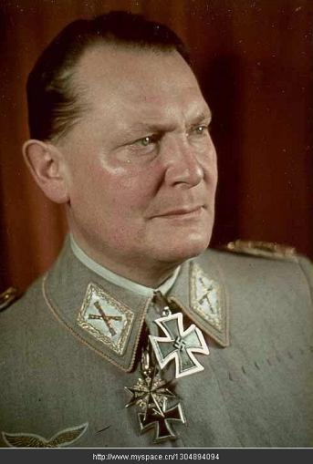

**1、帝国元帅——赫尔曼·戈林**

赫尔曼•威廉•戈林（Hermann Göring，1893年1月12日－1946年10月15日），纳粹德国空军元帅，德国纳粹党的二号人物，希特勒指定的接班人。戈林在第一次世界大战中是德国王牌飞行员，1928年当选为国会议员。1932年任国会议长。次年协助希特勒取得政权后，任空军部长、普鲁士总理兼内政部长，并主管秘密警察（盖世太保）。1935年任空军总司令。次年起为“四年计划”全权执行人。1940年任经济参谋部首脑，1941年6月，希特勒授予他位居其他元帅之上的大德意志帝国的帝国元帅军衔，地位仅次于希特勒。德国战败后，被纽伦堡国际军事法庭判处绞刑，执行前自杀。

  
  
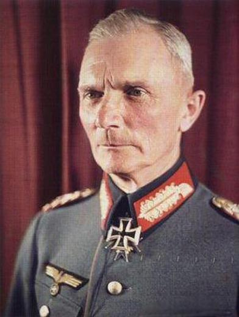

**2、陆军元帅——冯·包克**

费多尔·冯·博克(Fedor von Bock，1880年12月3日-1945年5月5日）。纳粹德国陆军元帅（1940年7月19日）。出身军人家庭，父亲曾升至少将。其先后担任第3集团军司令、第1集团军群司令、东线德军总司令、B集团军群司令，因盟军飞机的袭击伤重不治。  
  
  
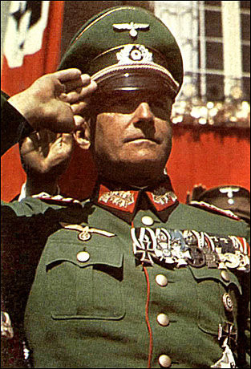

**3、陆军元帅——冯·勃劳希契**

勃劳希契(1881-1948) 纳粹德国陆军元帅（1940年7月）。第一次世界大战时为炮兵上尉，1912年调总参谋部任参谋。1933-1937年历任第一师师长、普鲁士军区司令、第一军军长、第四集团军司令。在施莱歇暗杀事件中被指控收希特勒的捐款。1938年升为上将，任陆军总司令，指挥德军进占奥地利和捷克斯洛伐克的苏台德区。1939-1940年相继指挥进攻波兰、荷兰、比利时和法国诸战役，连连获胜。1940年7月晋升元帅。1941年指挥入侵南斯拉夫、希腊和苏联。由于对苏闪击战失败，同年12月被希特勒强迫辞职。转入预备役后隐名度日。1945年被英军俘虏。后因心脏病死于汉堡战俘营。

  
  
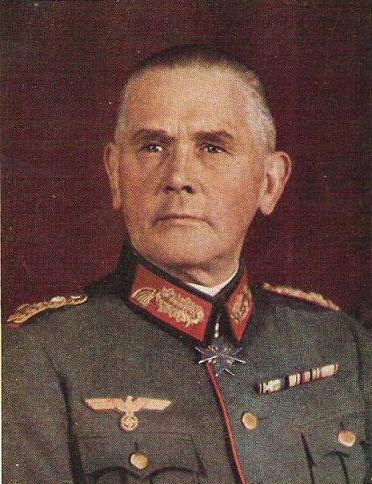

**4、陆军元帅——冯·勃洛姆堡**

维尔纳·爱德华·弗里茨·冯·勃洛姆堡（Werner Eduard Fritz von Blomberg，1878年9月2日—1946年3月14日），又译布隆伯格，纳粹德国陆军元帅（1936年4月20日），曾任纳粹德国国防部长、武装部队总司令。二战前因“与妓女通婚”、“弗立契事件”被希特勒解除了职务，直到战争结束都没有再被启用担当任何军职，1945年被盟军拘捕，1946年3月於扣留期间在纽伦堡的监狱中病逝。

  
  
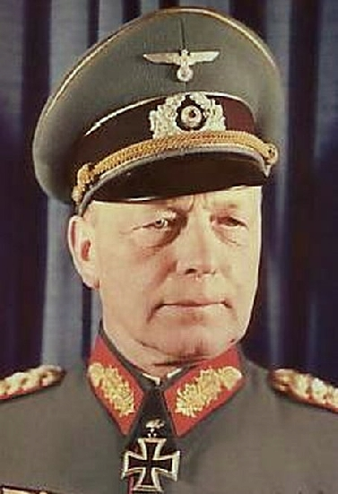

**5、陆军元帅——冯·克莱斯特**

冯克莱斯特(Kleist1881.8.8-1954.10)，纳粹德国陆军元帅（1943年2月1日）。出自军人世家，其高祖曾是普鲁士国王弗里德里希二世麾下的元帅；其曾祖父、祖父也多是勇敢的军人。其先后担任第一坦克军军长、A集团军群的坦克集群司令、A 集团军群总司令、1944年3月，被希特勒解除一切职务并退役。战争结束后，克莱斯特作为战犯被判处15年监禁，1954年病逝于苏联弗拉基米罗夫卡监狱。  
  
  
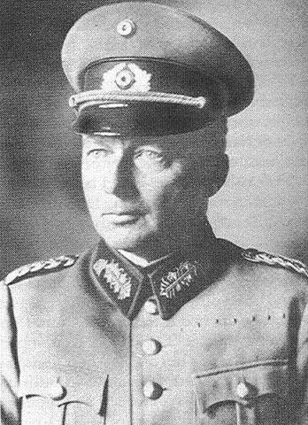

**6、陆军元帅——冯·克鲁格**

京特·冯·克鲁格（Günther von Kluge，1882年10月30日－1944年8月19日），是第二次世界大战期间德国的高级将领，他出生于波兹南的一个普鲁士军事世家；日后在德意志国防军中晋升为元帅（1940年7月）。最后职位为西线总司令。被希特勒召回柏林途中自杀。

  
  
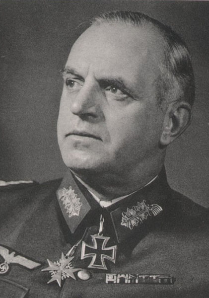  
**7、陆军元帅——恩斯特·布施**

恩斯特·布施(Busch1885.7.6—1945.7.17)，纳粹德国陆军元帅(1943.2.1)，先后担任第八军军长、第十六集团军司令、东线中央集团军群司令、西线德军集群司令，德国投降后被英军俘虏，在战俘营中死于心脏病。

  
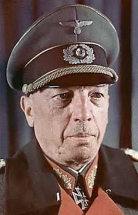

**8、陆军元帅——冯.库克勒**

冯.库克勒（von Kuechler, Georg 1881-1969），纳粹德国陆军元帅(1943.2.1)，1933年指挥第3集团军(上将衔)，入侵波兰。因反对对平民的屠杀而被解职。1940年调任第18集团军司令，入侵荷兰、比利时和法国。同年6月进占巴黎。1941年6月，率所部进攻苏联。翌年1月升任北方集团军群司令，获元帅衔。负责围攻列宁格勒，屡次受挫。1944年1月，在苏军第一次打击下败退，被希特勒解职。第二次世界大战后作为战犯，被纽伦堡国际军事法庭判处20年徒刑。1953年获赦，定居联邦德国。  
  
  
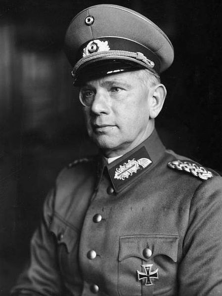

**9、陆军元帅——冯·赖歇瑙**

冯·赖歇瑙(Richenau)(1884.8.4-1942.1.17)，纳粹德国陆军元帅(1940.7.19)，1930年任第一军区（东普鲁士）参谋长。1933年希特勒上台后，任国防军部部长办公室主任。1936年获中将衔，任第七军区（巴伐利亚）司令。1938年参加吞并奥地利。1939年指挥第十集团军入侵波兰，晋升上将。翌年调任第六集团军司令，进攻比利时和法国，晋升元帅。1941年率所部闪击苏联，12月升任南方集团军群司令。翌年1月心脏病猝发致死。

  
  
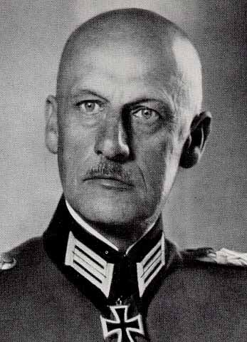

**10、陆军元帅——冯·勒布**

威廉·约瑟夫·弗朗茨·冯·勒布(Ritter Wilhelm von Leeb，1876.9.5～1956.4.29)，纳粹德国陆军元帅(1940.7.19)，1898-1901年参加八国联军侵华镇压义和团运动。1903年毕业于巴伐利亚军事学院。1930年任第七军区(慕尼黑)司令兼第7师师长，晋升中将。希持勒上台后，升任第二集团军司令。1934年升炮兵将军，成为德国战史上著名的防守战略家，反对发动战争，对虐待犹太人的政策极为反感。1938年2月曾被希特勒解职，退役。同年7月重新服役，出任第十二集团军司令，参加进占捷克斯洛伐克苏台德区。后调任西线C集团军群司令。1940年参加攻占法国，晋升元帅。翌年调往东线，任闪击苏联的北方集团军群司令，率部沿波罗的海岸向列宁格勒方向进攻。1942年1月，因久攻列宁格勒不下而被解职，转入预备军。1944年退役。翌年被美军逮捕。第二次世界大战后作为战犯，在纽伦堡美国军事法庭上被判处3年徒刑，后获释。

  
  
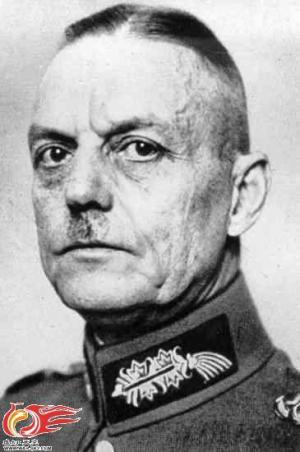

**11、陆军元帅——冯·龙德施泰特**

卡尔·鲁道夫·格尔德·冯·龙德施泰特（德语：Karl Rudolf Gerd von Rundstedt，1875年12月12日－1953年2月24日），纳粹德国陆军元帅（1940年7月19日）。纳粹政权军官中资历最老的指挥官之一。曾任第1集团军群司令、西线德军总司令。战后被俘后被释放，1953年死于心脏病。

  
  
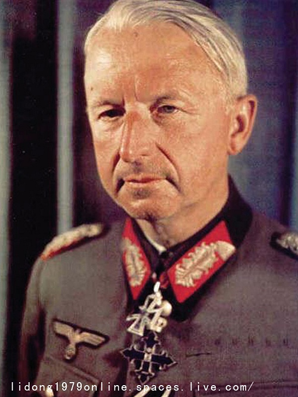

**12、陆军元帅——冯·曼施泰因**

弗里茨·埃里希·冯·曼斯坦因（Fritz Erich von Manstein），纳粹德国陆军元帅（1942年7月），与隆美尔和古德里安被后人并称为第二次世界大战期间纳粹德国的三大名将。曾任第11集团军司令、“顿河”集团军群司令、“南方”集团军群司令，1949年被英国军事法庭判处18年监禁。1953年获释。1973年6月病逝。

  
  
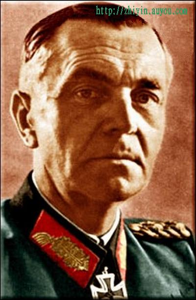

**13、陆军元帅——弗利德里克·保卢斯**

弗里德里希·威廉·恩斯特·保卢斯(Friedrich Wilhelm Ernst Paulus 1890年9月23日-1957年2月1日),纳粹德国陆军元帅（1943年1月31日）。其曾任陆军副总参谋长、第6集团军司令。是二战中第一位被俘的德军元帅。1953年从苏联战俘营释放，1957年病逝于东德。  
  
  
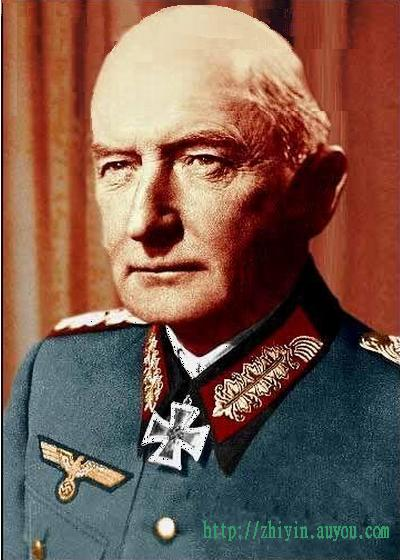

**14、陆军元帅——冯·维茨勒本**

约本-威廉·格奥尔格·"埃尔温"·冯·维茨勒本（Job-Wilhelm Georg "Erwin" von Witzleben；1881年12月4日－1944年8月8日），纳粹德国陆军元帅（1940年7月19日）。曾任第3军区司令兼第3军军长、第一集团军司令、D集团军群总司令、西线德军总司令。因参与刺杀希特勒的密谋案被判叛国罪获处绞刑，于1944年8月8日死于柏林的普芦茨恩湖监狱。  
  
  
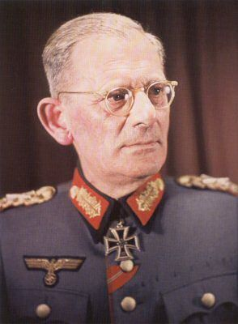

**15、陆军元帅——冯·魏克斯**

马克西米利安·马里亚·约瑟夫·卡尔·加布里尔·拉莫拉尔·赖希斯弗赖赫尔·冯·魏克斯·楚·格隆（Maximilian Maria Joseph Karl Gabriel Lamoral Reichsfreiherr von Weichs zu Glon，1881年11月12日 - 1954年6月27日），纳粹德国陆军元帅（1943年1月30日）。其先后任第七军区司令兼第七军军长、第十三军军长、第2集团军司令、B集团军群总司令。1945年5月，魏克斯被美军俘虏，后免于起诉，1954年9月27日，病逝于波恩附近的勒斯贝格。

  
  
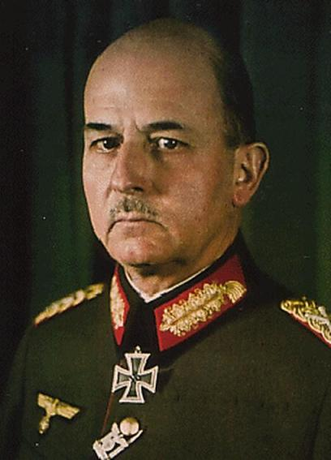

**16、陆军元帅——西格蒙德·李斯特**

威廉-李斯特 Wilhelm List（1880~1971），纳粹德国陆军元帅（1940年7月19日）。曾任德雷斯顿步兵学校校长、第4军军长、第12集团军司令、巴尔干占领军司令、A集团军群司令。二战后被判处无期徒刑，1952年被因病释放，定居联邦德国，1971年去世。  
  
  
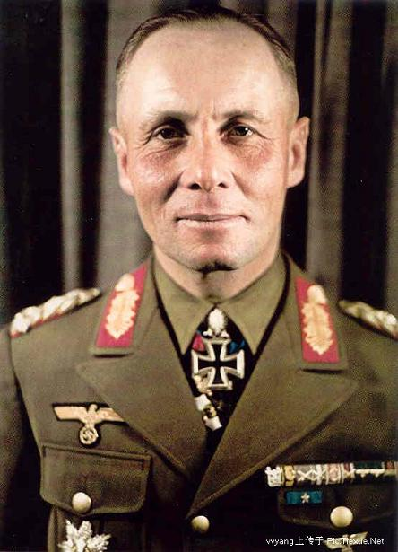

**17、陆军元帅——埃温·隆美尔**

埃尔温·隆美尔（Erwin Johannes Eugen Rommel1891.11.15-1944.10.14），纳粹德国陆军元帅（1942年1月）。其曾担任第7装甲师师长、德国非洲军军长、B集团军群司令。因株连于行刺希特勒未遂事件，被迫服毒自尽。人称“沙漠之狐”隆美尔是二战德军中最优秀的将领，这位纳粹的战神其高超的军事素质和出色战术才能受到了许多军事爱好者，甚至是著名军事家的尊敬和崇拜。  
  
  
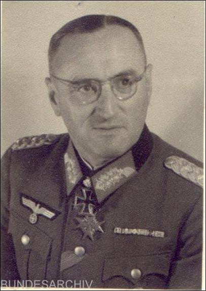

**18、陆军元帅——斐迪南德·舍尔纳**

  
约翰·费迪南德·舍尔纳（1892年12月5日－1973年2月7日），纳粹德国陆军元帅（1945年4月5日）。曾任第19山地军军长、南方集团军群总司令、北方集团军群总司令、中央集团军群总司令、阿尔卑斯山要塞总司令、德意志帝国陆军总司令。1945年被俘，1973年因心脏病去世。  
  
  
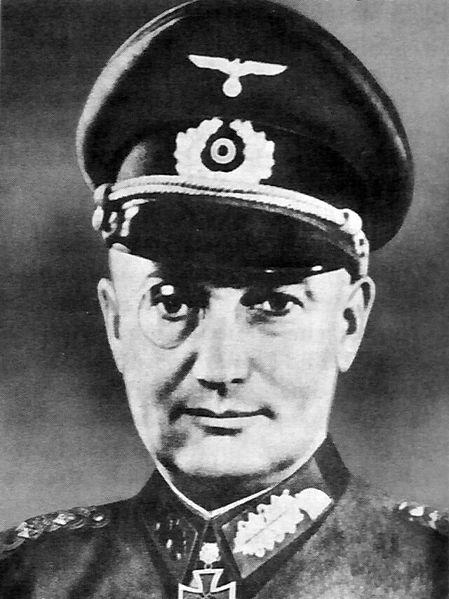

**19、陆军元帅——瓦尔特·莫德尔**

瓦尔特·莫德尔(Model)(1891.1.24—1945.4.21)，纳粹德国陆军元帅(1944.3.1)。曾任第十六集团军参谋长、第四十一坦克军军长、第九集团军司令、第二装甲集团军司令、南方集团军群总司令、中央集团军群总司令、西线德军总司令兼D集团军群总司令。战败自杀。

  
  
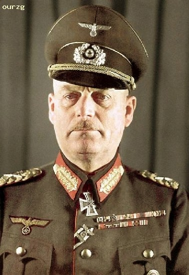

**20、陆军元帅——威廉·凯特尔**

威廉·凯特尔威廉•凯特尔（Wilhelm Keitel，1882—1946），纳粹德国陆军元帅（1940年7月）。曾任陆军部局长、国防军参谋长，是希特勒最信赖的军事顾问及其意志的积极执行者。1946年10月16日被执行绞刑。  
  
  
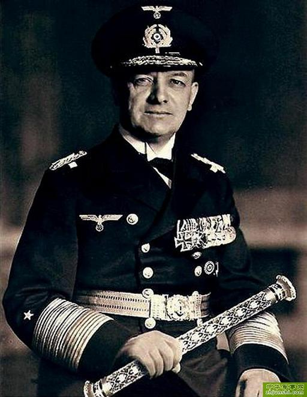

**21、海军元帅——埃里希·雷德尔**

埃里希·雷德尔(Raeder)(1876.4.24—1960.11.6)，纳粹德国海军元帅(1939.4.1)。曾任北海轻舰队司令、波罗的海军区司令、海军总司令。战败后被判终身监禁，1955年9月因健康状况不佳被释放。 1960年11月6日在基尔逝世。

  
  
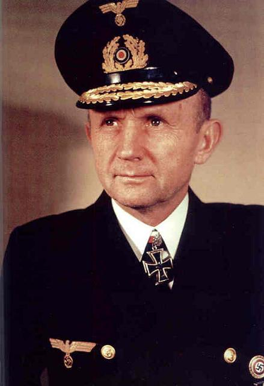

**22、海军元帅——卡尔·邓尼茨**

卡尔·邓尼茨（Karl Doenitz，1891—1980），纳粹德国海军元帅（1943年1月）。其先后担任海军潜艇部队总司令、海军总司令。1945年5月1日接任纳粹德国国家元首和最高司令，5月8日代表纳粹德国签署无条件投降书。后被判有期徒刑10年，1956年刑满获释。1980年12月24日病逝于奥姆勒恩。

  
  
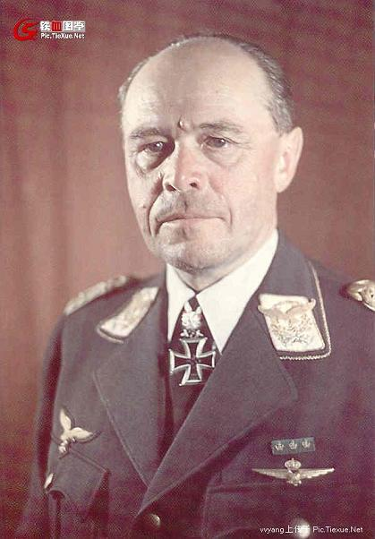

**23、空军元帅——阿尔勃特·凯塞林**

阿尔勃特。凯塞林（1885——1960），纳粹德国空军元帅（1940年7月19日）。其先后任空军第三军区司令、空军第一航空队司令官、南欧战场德国空军总司令、西线总司令、南线总司令。战后被判死刑，后改判为终身监禁。1952年10月，被释放出狱，1960年7月16日因心脏病逝世。

  
  
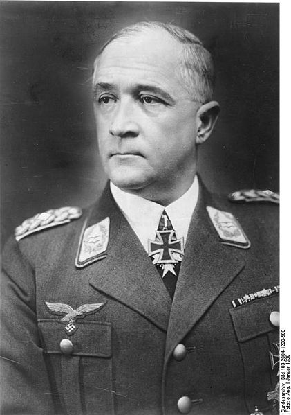

**24、空军元帅——冯·格莱姆**

罗伯特·里特尔·冯·格莱姆（Robert Ritter von Greim; 1892年6月22日 – 1945年5月24日），纳粹德国空军元帅（1945年4月25日）。一战后应当时中国蒋介石政府的要求前往中国广州，协助成立中国陆军航空队。二战后先后任航空师师长、第5航空军军长、空军东线司令、第六航空队总司令、空军总司令。1945年5月24日服毒自杀。

  
  
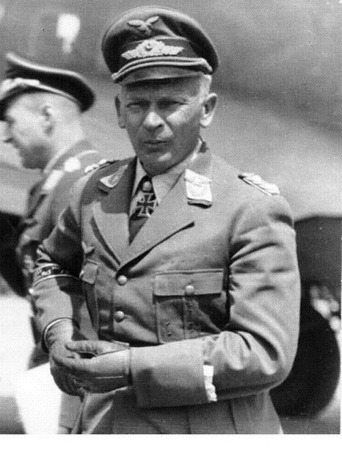

**25、空军元帅——冯·里希特霍芬**

沃尔夫冈·冯·里希特霍芬(Wolfgang von Richthofen,1895～1945.7.12) ，纳粹德国空军元帅（1943年2月16日）。曾任航空师师长、第8航空军军长、第4航空队总司令兼东南线德军集群总司令、第2航空队总司令。1945年7月12日，因病在奥地利去世。  
  
  
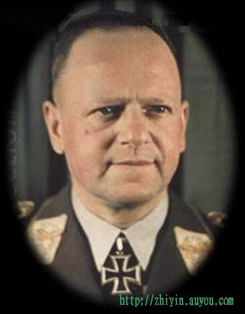

**26、空军元帅——埃哈德·米尔希**

艾尔哈德·阿尔弗雷德·理查德·奥斯卡·米尔希（Erhard Alfred Richard Oskar Milch1892年3月30日－1972年1月25日），纳粹德国空军元帅（1940年）。曾任空军航空部副部长兼空军装备主任、空军总监、1947年判处无期徒刑。1954年提前获释，1972年1月25日去世。

  
  
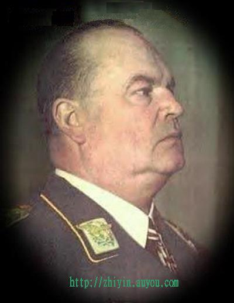  
**27、空军元帅——雨果·施佩勒**

雨果.施佩勒Sperrle,Hugo (1885-1953) ，纳粹德国空军元帅（1940年）。曾任第3航空队司令、驻法国空军司令。1948年获释，定居联邦德国，1953年4月2日去世。

