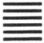

1.乾为天

2.坤为地

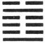

3.水雷屯

4.山水蒙

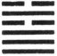

5.水天需

6.天水讼

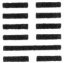

7.地水师

8.水地比

9.风天小畜

10.天泽履

11.地天泰

12.天地否

13.天火同人

14.火天大有

15.地山谦

16.雷地豫

17.泽雷随

18.山风蛊

19.地泽临

20.风地观

21.火雷噬嗑

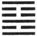

22.山火贲

23.山地剥

24.地雷复

25.天雷无妄

26.山天大畜

27.山雷颐

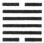

28.泽风大过

29.坎为水

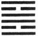

30.离为火

31.泽山咸

32.雷风恒

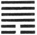

33.天山遯

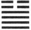

34.雷天大壮

35.火地晋

36.地火明夷

37.风火家人

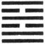

38.火泽睽

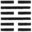

39.水山蹇

40.雷水解

41.山泽损

42.风雷益

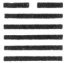

43.泽天夬

44.天风姤

45.泽地萃

46.地风升

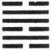

47.泽水困

48.水风井

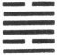

49.泽火革

50.火风鼎

51.震为雷

52.艮为山

53.风山渐

54.雷泽归妹

55.雷火丰

56.火山旅

57.巽为风

58.兑为泽

59.风水涣

60.水泽节

61.风泽中孚

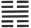

62.雷山小过

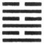

63.水火既济

64.火水未济

